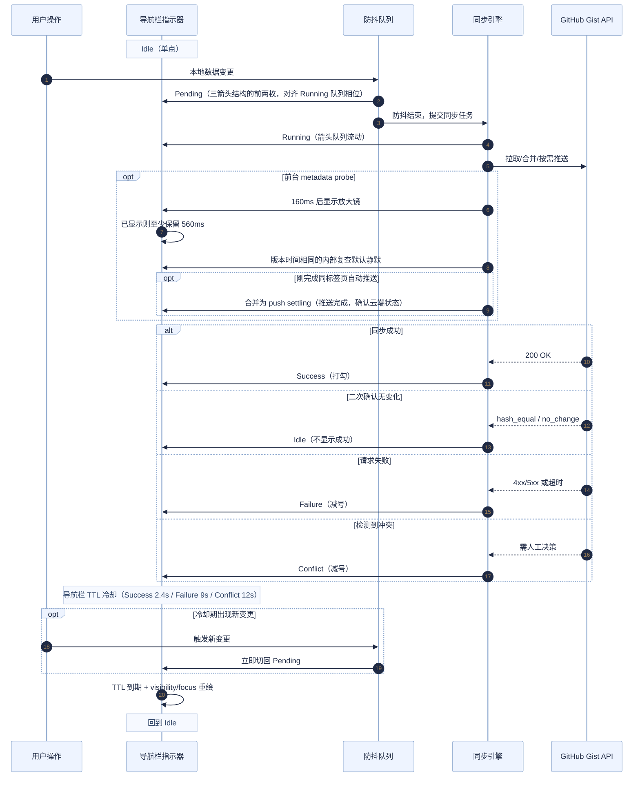

# S1 Plus 开发手册（当前代码基线：v6.10.0 + 当前分支未发布同步重构与玻璃系统重构）

> 本文档基于当前 `S1Plus.js` 实现整理，用于指导后续开发、调试、测试与发布。

## 1. 项目形态与约束

- 架构：单文件用户脚本（`S1Plus.js`）
- 构建：无打包/编译步骤，直接编辑源码
- 运行环境：Tampermonkey / Violentmonkey / Greasemonkey
- 核心依赖：Greasemonkey API（`GM_*`）+ 浏览器 DOM API

这意味着所有改动都应以“可直接在浏览器执行”为前提，避免引入构建期依赖。

## 2. 本地开发（保存即生效）

### 2.1 浏览器前置设置（Chrome/Edge）

1. 打开 `chrome://extensions`
2. 进入 Tampermonkey 的“详情”
3. 开启“允许访问文件网址（Allow access to file URLs）”

### 2.2 推荐 Loader（本地文件热加载）

仓库里已经提供了两份可直接使用的本地加载器：

- `S1Plus-Local-Mac.user.js`
- `S1Plus-Local-Windows.user.js`

如果要手动新建，也可以参考下面这个模板：

```javascript
// ==UserScript==
// @name         S1 Plus (Local)
// @namespace    http://tampermonkey.net/
// @version      99.9.10
// @description  本地开发加载器
// @author       Antigravity
// @match        https://stage1st.com/2b/*
// @require      file:///[YOUR_LOCAL_PATH]/S1Plus.js
// @grant        GM_setValue
// @grant        GM_getValue
// @grant        GM_addStyle
// @grant        GM_deleteValue
// @grant        GM_xmlhttpRequest
// @grant        GM_openInTab
// @grant        GM_download
// @grant        GM_addValueChangeListener
// @connect      *
// ==/UserScript==

(function () {
    "use strict";
    console.log("[S1 Plus] Local loader active");
})();
```

注意事项：

- 关闭线上正式脚本，避免双实例冲突
- `@require` 必须是绝对路径
- Windows 路径示例：`file:///C:/Users/Name/S1Plus-Manual/S1Plus.js`
- 本地 Loader 的 `@grant` / `@connect` 需要与主脚本保持一致；当前主脚本使用 `@connect *`

### 2.3 迁移回归校验（建议每次改设置迁移后执行）

```bash
node tests/settings-migration/test-settings-migration.js
```

说明：

- 用例夹具：`tests/settings-migration/fixtures.json`
- 覆盖重点：旧版 `openInNewTab` 结构迁移、布尔归一化、自动补链旧键迁移、Token 到期字段归一化等

### 2.4 同步回归脚本（本轮多标签页重构）

当前仓库把同步专项测试脚本收敛在 `tests/`，常见入口包括：

- `test-foreground-remote-probe.js`
- `test-foreground-trigger-integration.js`
- `test-startup-sync-freshness.js`
- `test-visible-remote-polling.js`
- `test-post-sync-refresh-policy.js`
- `test-safe-sync-execution.js`
- `test-cleanup-provenance-guard.js`
- `test-background-open-passive-session.js`
- `test-background-sync-shared-debounce.js`
- `test-title-sync-status.js`
- `test-remote-push-uncertain-write.js`

建议在改动以下能力后优先回归对应脚本：

- 前台探测 / 可见页轮询
- 自动拉取后的刷新策略
  - `pulled / force_pulled`：列表页 / 普通页可按策略延迟整页刷新
  - `merged_read_progress`：只表示阅读进度自动合并，已导入本地后应走 `read_progress_merged_inline` 原地刷新阅读进度按钮，不应排队整页 reload
- 启动同步本地较新判断
  - `test-safe-sync-execution.js` 覆盖 `startup + read_progress_only_changed` 应进入 `merge_read_progress`，而核心数据本地较新仍应保持 `skipped_push_on_startup`
  - `test-background-sync-shared-debounce.js` 覆盖阅读进度 pending / shared debounce 清理与后续补同步
- cleanup provenance 与手动同步分支
- Gist PATCH 结果不确定、metadata-only 诊断日志、后台 shared retry
- 导航栏直接拉取 / 推送的手动覆盖路径
  - `test-safe-sync-execution.js` 覆盖 manual override 清理手动、后台、启动、前台补同步与全局锁，清理 pending auto sync，并重置运行时 pending、retry、heartbeat 状态
  - 同脚本覆盖远端请求重试退避期间被手动覆盖取消后不会再发起下一次 HTTP 请求
- 设置迁移与同步设置 UI
- 标签页标题同步状态、Title Owner handoff、Running Phase / Live Runner 语义
  - 先跑 `node tests/test-title-sync-status.js`
  - 若触及 sync lock / background sync lock，再跑 `node tests/test-background-sync-shared-debounce.js` 和 `node tests/test-safe-sync-execution.js`

### 2.5 UI 样式静态校验

弹窗、浮层、滚动条、图片查看器等样式改动后，建议运行以下静态脚本：

```bash
node tests/test-popover-surface-css.js
node tests/test-glass-surface-readability-css.js
node tests/test-settings-tab-panel-css.js
node tests/test-category-c-and-image-viewer-glass-css.js
```

覆盖重点：

- 类型 B 浮层分层：用户标记编辑器 / 日期选择器 / 确认型浮层 / 普通短 tooltip / 文档型帮助浮层使用轻磨砂；纯操作入口菜单保持实底。
- 弹窗与浮层可读性：全屏蒙版只保留低强度无色 blur，确认类一级弹窗本体通过 `.s1p-first-level-glass--confirm` 间接复用 floating surface 背景、阴影和滤镜；设置/调试大面板通过 `.s1p-first-level-glass--settings` 间接使用 dialog glass 变量，Token 日期配置和同步弹窗内部信息块继续使用 dialog glass 变量。浅色、深色模式都要同步维护。
- 设置承载的二级弹窗：Token 有效期、阅读记录详情、设置内确认/输入弹窗、设置内手动同步选择等必须显式 opt-in 到 settings secondary glass（`S1P_SETTINGS_SECONDARY_GLASS_CLASS`、`buildSettingsSecondaryGlassClassName()` 或 `useSettingsSecondaryGlass: true`），不要通过全局 `.s1p-modal` 查询推断上下文。
- 弹窗与浮层定位：所有贴近右侧边界的 tooltip / popover / inline menu 必须使用布局视口宽度（`document.documentElement.clientWidth`，当前封装为 `getS1pLayoutViewportWidth()`）做横向夹取，不要直接用 `window.innerWidth`。`window.innerWidth` 会包含垂直滚动条槽，tooltip 可能被放进滚动条槽内，hover 时触发 1px 水平滚动条。
- 自定义 UI 最外层容器不显示描边；输入框、按钮、分割线、表格和设置面板内部列表项仍可保留功能性边界。
- 设置面板滚动条复用脚本自定义样式，并在 S1 NUX 启用时跟随 `--prid` / `--pridb`，轨道保持透明。
- 图片查看器全屏蒙版保持无色 blur，图片舞台沿用浅色浅黄绿 / 深色深灰蓝主题底色并轻磨砂；上一张/下一张按钮的默认态阴影只通过 `--s1p-image-viewer-nav-btn-shadow` 调整，不要连带修改 hover、背景或 blur。

这些脚本只做源码级 CSS 断言，不能替代浏览器截图验收；涉及透明度、背景复杂度和 NUX 主题时仍需手动打开页面观察。

### 2.6 右下角统一调试面板

代码中保留了可复用的浮动调试面板框架，现整合为统一的 `#s1p-debug-unified-panel`，通过 tabs 组织四个子面板，默认不自动显示。

**入口方式**：设置弹窗底部版本号悬停 4s 出现小圆点后点击，打开统一面板；无其他入口。

**面板结构**：

| Tab | 内容 | 说明 |
|-----|------|------|
| 日志 | 调试控制台 | 捕获 console 输出、JS 错误、unhandledrejection；支持按级别筛选、关键词搜索、复制/清空/展开；可拖拽 resize，尺寸持久化到 `s1p_debug_console_size`；日志缓冲区最多保留 1000 条，通过 `sessionStorage` 在同标签页刷新后自动恢复，关闭标签页后销毁 |
| 诊断信息 | 同步诊断 | 展示 `buildSyncDiagnosticsRows()` 的诊断行（最近动作/触发源/结果/阻断/哈希/探测等）；[刷新][复制诊断][重置诊断] 按钮 |
| 指示器调试 | 同步指示器调试 | 手动切换指示器 phase、选择 source/operation、播放固定转场 Demo（含 pending push/pull → running、probe → pull）；只覆盖导航栏指示器预览，不改真实同步状态 |
| UI 组件 | 组件展示与弹窗预览 | 按类别展示按钮、开关、输入、列表、确认栏、tooltip 等组件；弹窗预览覆盖确认/输入/高级确认、版本欢迎、S1 NUX 推荐、手动同步选择、启动同步冲突、Token 过期提醒、Token 日期配置、阅读记录详情、图片查看器等场景 |

**实现要点**：

- tab bar 复用 `s1p-tabs` 样式（与设置面板 tab 统一），靠左对齐，带 slider 高亮动画
- 面板搜索框复用 `.s1p-input` 样式
- 日志 tab 的 toolbar 布局为 head-actions 在上行、filter-bar 在下行
- 诊断信息 tab 的重置操作使用内联确认栏而非原生 `confirm()` 弹窗
- 统一面板外层复用 `.s1p-glass-panel`，与设置面板共享同一套外壳磨砂参数；不要在调试面板选择器里另写 `background` / `backdrop-filter`
- UI 组件 tab 的弹窗预览会在打开真实弹窗前挂载临时可读性测试背景，并清理旧的预览弹层、Token 配置弹窗、日期选择器和图片查看器状态；这只服务人工视觉回归，不应影响真实业务弹窗入口
- 指示器调试 tab 的主体内容使用单一无边框浅底 surface 承托文字和按钮，避免文字直接落在复杂磨砂背景上；不要给内部说明/状态块再叠独立边框卡片
- 调试面板内承载长列表的实底 surface 应由滚动视口自己负责圆角裁切（如日志区使用 `overflow: hidden auto` + 透明轨道滚动条），不要把圆角放到内部列表行上，否则滚动到中间会露出直角截面
- 深色模式下统一调试面板主容器阴影使用大半径低透明度的单层阴影，避免在深背景上形成可见分层断带
- 指示器调试面板仍可通过 `window.__s1pAutoSyncIndicatorDebug` API 控制：
  - `showPanel()` — 打开统一面板并切到指示器调试 tab
  - `hidePanel()` — 隐藏统一面板
  - `clear()` — 清除调试覆盖
  - `pushPendingToRunning()` / `pullPendingToRunning()` — 预览 pending 方向箭头接入 running 队列的转场
  - `probeToPull()` — 预览放大镜 probe 切换到拉取队列的转场

**使用约束**：

- 调试面板只覆盖导航栏指示器的预览显示，不会改写真实同步状态
- 面板中“实际 phase/source/operation”和“实际显示”仍读取真实状态，可用于对照预览覆盖；“预览显示”展示经显示层解析后的 `phase / operation`，用于确认调试覆盖是否真的命中目标图标类型
- `running` 等状态的调试预览会跳过真实同步锁门控，仅用于人工观察 UI
- 统一面板的显示状态持久化到 `s1p_debug_console_visible`（GM 存储，跨标签一致）；尺寸持久化到 `s1p_debug_console_size`（GM 存储）
- 日志收集器生命周期：仅在调试面板可见时启动（`document-start` 阶段检查 `s1p_debug_console_visible`）；面板隐藏时调用 `stopLogCollector()` 恢复原始 console 方法并移除事件监听器
- 日志持久化：通过 `sessionStorage` 键 `s1p_log_buffer` 实现，每条日志 300ms 防抖写入；刷新页面后 `restoreLogBufferFromSession()` 自动恢复（包括展开状态）；清空日志时同步清除 sessionStorage
- 日志收集器可在同页面会话内多次启停（通过 `startLogCollector` / `stopLogCollector`），每次启动捕获当前 console 引用，并在停止时只恢复 S1 Plus 自己安装的 wrapper，避免多轮 bind 嵌套或覆盖其他脚本后续安装的 console patch
- 这套面板框架应优先作为通用调试容器复用，而非为每个功能再单独写一套浮动面板

## 3. 多机协作流程（Git）

### 3.1 首次在新设备

1. `git clone` 仓库
2. 按上节配置本地 Loader
3. 校验 `@require` 路径

### 3.2 日常

- 设备 A：`git add` -> `git commit` -> `git push`
- 设备 B：`git pull`
- 刷新论坛页面即生效（无需重装脚本）

## 4. 代码模块地图（按职责）

可在 `S1Plus.js` 搜索以下函数快速定位。

### 4.1 安全与基础工具

- `sanitizeHtmlFragment`：受控 HTML 白名单清洗
- `getSafeUrlAttributeValue`：URL 安全校验
- `isPrimaryUnmodifiedClick`：统一判定“普通左键点击”（排除 Ctrl/Cmd/Shift/Alt 与已拦截事件）
- `sanitizeRecordObject`：对象键净化（防原型链污染）
- `deterministicSort` / `sha256`：稳定序列化与哈希

### 4.2 数据层与缓存

- `getSettings` / `saveSettings`
- `getBlockedThreads` / `saveBlockedThreads`
- `getBlockedUsers` / `saveBlockedUsers`
- `getBlockedPosts` / `saveBlockedPosts`
- `getUserTags` / `saveUserTags`
- `getBookmarkedReplies` / `saveBookmarkedReplies`
- `getTitleFilterRules` / `saveTitleFilterRules`
- `getReadProgress` / `saveReadProgress`

### 4.3 同步引擎

- `exportLocalDataObject` / `importLocalData`
- `fetchRemoteData` / `pushRemoteData`
- `performAutoSync`（自动同步决策与执行）
- `handleManualSync`（手动同步流程）
- `handleForcePull` / `handleForcePush`（导航栏直接拉取 / 推送）
- `preemptActiveSyncForManualOverride`（显式手动覆盖时抢占当前同步状态）
- `decideSyncActionByVersion`（基线 + 哈希 + 时间戳判定）

### 4.4 UI 主干

- `createManagementModal`（7 个 tab 设置面板）
- `initializeNavbar`（导航注入、同步按钮、状态指示）
- `createAdvancedConfirmationModal`（统一确认弹窗）

### 4.5 页面增强主入口

- `runS1PlusInitializer`：脚本实际入口，先运行 `document-start` 阶段，再等待 `document.body`。
- `S1P_INIT_PHASES` / `runInitializationPhase`：分阶段初始化框架，当前阶段为 `document-start`、`body-ready`、`forum-ready`、`services-ready`、`content-ready`、`deferred`。
- `main`：body ready 后的初始化总控，按阶段调度迁移、论坛 DOM 依赖任务、服务注册、内容扫描与延后同步。
- `applyChanges`：全量应用
- `MutationObserver` 增量分发：列表/帖子/引用/评分/提醒五路处理

实现约束（维护时请保持）：

- `document-start` 阶段只放低依赖、防闪烁类任务；不要依赖完整论坛 DOM。
- 依赖论坛结构或 NUX 标记的逻辑应放在 `forum-ready`，并通过框架的 `retryDelays` / `shouldRetry` 表达等待条件。
- 首次 DOM 扫描和 MutationObserver 挂载属于 `content-ready`；启动同步、推荐弹窗等非首屏任务属于 `deferred`。
- 后台任务如果会影响后续判断，应通过 `contextKey` 暴露 promise，例如 NUX 推荐会等待 `nuxDetectionPromise`，避免检测未结束时误判。

### 4.6 增强悬浮控件（Floating Controls）

- `manageFloatingControls`：根据设置开关统一创建/销毁增强悬浮控件
- `createCustomFloatingControls`：构建手柄 + 动作面板 + 按钮（语义化 `a/button`）
- `bindFloatingControlsHoverInteraction`：控件交互状态机（悬停开合、固定展开、外部点击关闭）

实现约束（维护时请保持）：

- 使用单一开合状态源：仅通过 `s1p-floating-controls-open` class 控制显隐，避免 CSS `:hover` 与 JS 定时器竞态。
- 悬停判定基于“交互区域来源集合”（handle/panel），不要回退为依赖 wrapper 自身 hover。
- 关闭路径分为两类：延迟收起（hover 离开）与立即收起（取消固定/外部点击），两者清理逻辑需统一。

### 4.7 通用 Tooltip

- `setCustomTooltip`：注册普通 tooltip，并负责清理所有 tooltip 相关 dataset，避免节点复用时残留旧配置。
- `setTemplateTooltip`：注册模板型 tooltip，统一写入 `delay / maxWidth / templateId` 配置；不要在调用处手写零散 dataset 赋值。
- `initializeGenericDisplayPopover`：统一处理普通/溢出/文档型 tooltip 的渲染、定位、滚动/缩放重排与宽度缓存。

实现约束（维护时请保持）：

- 新增富文本 tooltip 时，优先在 `tooltipTemplateConfigs` 中登记行为配置，再通过 `setTemplateTooltip` 接入调用点。
- 若模板 tooltip 依赖测宽缓存，需保持 `resize` 时清空缓存并重测，避免旧视口宽度残留；宽度缓存 key 也应使用 `getS1pLayoutViewportWidth()`，不要直接读 `window.innerWidth`。
- Tooltip 的 `positionTooltipPopover()` 横向边界必须基于布局视口（`getS1pLayoutViewportWidth()` + `window.scrollX`）。不要用 `window.scrollX + window.innerWidth` 作为右边界，否则有垂直滚动条时，靠右 tooltip 会落入滚动条槽并临时撑出底部水平滚动条。
- 需要取消 tooltip 时，优先走 `clearCustomTooltip`，不要只删 `fullTag` 或 class。
- 手柄需同步 `aria-expanded`，动作型入口优先使用 `button`，仅导航型入口使用 `a`。

### 4.8 UI 表面样式约定

当前弹窗与浮层按“外层负责分层、内部负责功能边界”维护：

- 全屏蒙版只提供无色 blur：顶层 `.s1p-fullscreen-modal` 通过伪元素统一提供 `blur(var(--s1p-overlay-blur))`，不要恢复全局黑色遮罩变量。设置面板 `.s1p-modal` 自身必须保持 `backdrop-filter: none`，由 `.s1p-modal-content.s1p-glass-panel` 直接负责外壳磨砂；设置面板内的 `.s1p-token-config-modal` 是面板内部二级弹窗，挂载在 `.s1p-modal-content` 内，不要提升为全屏模板。
- Overlay blur 必须保持低强度（当前浅色 `0.8px`、深色 `0.9px`）；不要用全屏 blur 来制造层次，文字承载面应靠自身背景、阴影和轻量 filter 保证可读性。
- `.s1p-glass-panel` 是设置面板与调试面板共用的外壳玻璃效果。复用时给最外层可见容器加这个类，并通过 `--s1p-glass-panel-bg` / `--s1p-glass-panel-filter` 调整；不要再创建 `--s1p-settings-panel-bg`、`--s1p-debug-console-panel-bg` 这类局部副本。
- `.s1p-glass-panel` 的正确采样路径是“可见外壳直接过滤页面背景”。不要把它放进另一个带 `backdrop-filter` 的父级里，也不要同时给父级和子级都加 blur；浏览器会建立 backdrop root，子级可能只采样到父级处理后的结果，导致设置面板与调试面板视觉不一致。
- Shell glass 的 blur 强度应跟随 `--s1p-dialog-glass-filter`（当前 `blur(3px) saturate(1.02)`）。不要为了“看起来更糊”硬编码 `blur(12px)` 等强滤镜；高对比小字会扩散成色块，反而不像调试面板的自然磨砂。
- 一级窗口玻璃集中由 `.s1p-first-level-glass` 加上预设变体类接管：`.s1p-first-level-glass--confirm` 映射到 floating surface 变量（`--s1p-floating-surface-bg/filter/shadow`），用于通用确认/输入/高级确认弹窗；`.s1p-first-level-glass--settings` 映射到 dialog glass 变量（`--s1p-glass-panel-bg/filter`、`--s1p-dialog-glass-shadow`），用于设置面板。`.s1p-modal-content`、`.s1p-glass-panel` 和 `.s1p-confirm-content` 保持为结构/语义类，只负责布局、尺寸、滚动、文本和动效，不拥有背景、阴影或 filter。
- Confirm dialog content（`.s1p-confirm-content`）正文走 `--s1p-dialog-text` / `--s1p-dialog-muted-text` 保证深浅模式可读性；在非 settings-secondary 上下文中自动附加 `.s1p-first-level-glass--confirm`，由一级玻璃类统一提供材质。Dialog glass（`--s1p-dialog-glass-*`）保留给 Token 日期配置和手动同步选择/对比表格等内部信息块；Shell glass（`.s1p-glass-panel`）用于设置面板、调试面板和同类大外壳；Image viewer glass 用于图片查看器工具栏和图片舞台；Floating surface（`--s1p-floating-surface-*` / `.s1p-floating-surface`）用于用户标记编辑器、日期选择器、确认型浮层、普通短 tooltip、文档型帮助浮层、标签菜单和 Toast 这类轻量浮层。
- Settings secondary glass（`.s1p-settings-secondary-glass`）只用于设置面板承载的二级窗口。通用 `createConfirmationModal` / `createInputModal` / `createAdvancedConfirmationModal` 必须通过 `useSettingsSecondaryGlass: true` 显式启用；设置面板内部可使用本地 helper 统一传参。不要在这些通用工厂里用 `document.querySelector(".s1p-modal ...")` 做全局回退，否则残留设置面板会让非设置弹窗误套主题。
- 轻量浮层必须优先复用 `--s1p-floating-surface-bg`、`--s1p-floating-surface-filter` 和 `--s1p-floating-surface-shadow`；需要贴近 tooltip 的特殊工具条（如导航栏拉取/推送行内菜单）可在这套变量基础上拆出局部 surface 变量，但不要回退到旧的实底 popover。带备注确认菜单的外层只负责布局，玻璃材质放在子 surface 上，避免中间 gap 被父级 backdrop 连成整块。
- Dialog glass / floating surface / toast / floating-control 都必须通过对应 `--s1p-*-bg`、`--s1p-*-filter` 与 `--s1p-*-shadow` 变量调参；优先微调背景 alpha 保证可读性，保持轻量 filter，不要在组件规则里硬编码 `blur(6px)` / `blur(8px)` 这类强磨砂。一级确认弹窗本体必须通过 `.s1p-first-level-glass--confirm` 预设整体应用材质，不要在其规则内单独切换背景、阴影或滤镜中的某一项。
- Toast 是短时提示，默认复用 floating surface；成功/错误提示可以保留语义色背景，但仍应保持透明度与磨砂一致，不要退回不透明色块。
- 决策弹窗正文走 `--s1p-dialog-text`，说明文字走 `--s1p-dialog-muted-text`；同步选择、同步冲突、欢迎、Token、阅读记录详情、手动屏蔽等共享 `.s1p-confirm-content` 的弹窗都要继承这套深浅模式文本 token。
- 纯操作入口菜单不再默认保持实底；标签选项菜单复用 floating surface，导航栏拉取/推送行内菜单使用更轻的局部 surface。若新增操作入口菜单，先按可读性判断复用 floating surface 或拆局部变量，不要直接套旧 `--s1p-popover-solid-*`。
- 自定义 UI 最外层容器默认 `border: none`，依靠背景、阴影和 blur 分层；不要给外壳补 1px 线框来“找边界”。
- 输入框、按钮、状态 chip、分隔线、表格、设置面板内部列表项属于功能性边界，可按可读性保留边框。
- 图片查看器面板 `.s1p-image-viewer__panel` 只负责圆角裁切、阴影和动画，不铺背景、不做 `backdrop-filter`；工具栏和图片舞台分别用 `--s1p-image-viewer-toolbar-bg`、`--s1p-image-viewer-viewport-bg` 独立控制，避免父子透明背景叠加导致舞台调参互相牵连。图片舞台本体只铺稳定主题底色，`.s1p-image-viewer__viewport::before` 用 `--s1p-image-viewer-viewport-glass-bg` + `--s1p-image-viewer-viewport-glass-filter` 负责磨砂层；浅色和深色必须保持同一套“底色层 + 磨砂层”结构，避免只在某个主题下直接过滤原页面。图片查看器上一张/下一张按钮的默认态阴影使用 `--s1p-image-viewer-nav-btn-shadow`，只调默认阴影时不要改 hover shadow、背景或 blur。
- 设置面板 `.s1p-modal-body` 负责滚动视口、圆角裁切、滚动条样式和固定内容底色，使用 `--s1p-settings-body-surface-bg`（浅色约 `color-mix(... 94%, transparent)`，深色约 `color-mix(... 98%, transparent)`）；`.s1p-tab-panels` 保持透明且不再持有圆角背景，避免滚动中右侧 scrollbar gutter 露出直角。S1 NUX 下滚动条 thumb 通过 `applyNuxSettingsScrollbarThemeFix()` 跟随 NUX 主题色，track 保持透明。

## 5. 存储键说明（GM Key）

### 5.1 业务数据

- `s1p_settings`
- `s1p_blocked_threads`
- `s1p_blocked_users`
- `s1p_blocked_posts`
- `s1p_user_tags`
- `s1p_bookmarked_replies`
- `s1p_title_filter_rules`
- `s1p_read_progress`

### 5.2 同步与状态

- `s1p_last_modified`
- `s1p_last_sync_timestamp`
- `s1p_sync_baseline_state`
- `s1p_sync_diagnostics`
- `s1p_pending_auto_sync_request`
- `s1p_auto_sync_indicator_state`
- `s1p_auto_sync_failure_count`
- `s1p_auto_sync_circuit_open_until`
- `s1p_auto_sync_conflict_pause`

### 5.3 锁与跨标签

- `s1p_background_sync_lock`
- `s1p_manual_sync_lock`
- `s1p_startup_sync_lock`
- `s1p_foreground_followup_sync_lock`
- `s1p_sync_global_lock`
- `s1p_sync_conflict_modal_cooldown_lock`
- `s1p_settings_refresh_signal`
- `s1p_title_sync_status_tabs`（标题同步状态 aggregate presence 镜像）
- `s1p_title_sync_status_tab:<tabId>`（标题同步状态 per-tab presence）
- `s1p_title_sync_status_presence_signal`（标题 presence 变更通知）
- `s1p_title_sync_status_owner`（标题 Title Owner lease）
- `s1p_title_sync_status_signal`（localStorage fallback signal）

### 5.4 其他状态

- `s1p_last_daily_sync_date`
- `s1p_last_manual_sync_info`
- `s1p_pending_cleanup_info`
- `s1p_last_token_check_date`
- `s1p_blocked_posts_collapsed_threads`
- `signedDate_<uid>` / `signedAttemptDate_<uid>`（自动签到）
- `s1p_v<version>_welcomed`（版本欢迎弹窗）
- `s1p_debug_console_visible`（调试面板显示状态，GM 存储，跨标签一致）
- `s1p_debug_console_size`（调试面板尺寸，GM 存储）

### 5.5 sessionStorage 键

以下键使用 `sessionStorage`（同标签页刷新保留，关闭标签页销毁）：

- `s1p_log_buffer`（调试日志缓冲区 JSON，含 entries / nextId / expandedIds）
- `s1p_navbar_sync_alert_session_dismiss_key`（导航栏同步提醒会话级关闭标记）

## 6. 同步机制要点（开发必须了解）

### 6.1 同步对象结构

`exportLocalDataObject()` 产出结构（当前版本 `5.0`）：

- `version`
- `lastUpdated`
- `contentHash`
- `baseContentHash`（不含阅读进度）
- `data`（settings + 全量业务数据）

### 6.2 决策优先级

1. 优先 baseline/hash 判定
2. 必要时回退时间戳判定（带 12h 偏差保护）
3. 双端都变更 -> 冲突
4. 仅阅读进度分歧且基础数据一致 -> 自动合并
5. 启动同步遇到“云端等于基线、本地较新”时，先做本地变更分类；若 `baseContentHash` 证明除阅读进度外数据一致，则进入 `merge_read_progress` 并复用 `merged_read_progress` 自动合并回写，不再升级为 `skipped_push_on_startup`

补充：

- 启动期现在通过 startup orchestrator 决定执行路径：`fresh` 页面运行完整启动链路，`stale` 页面只顺延每日首次同步或直接跳过启动专属检查。
- 启动新鲜度不是单一硬编码超时：基础新鲜窗口为 `STARTUP_SYNC_BASE_FRESH_WINDOW_MS`（当前 4s）；若流程晚到但页面仍可见且自调度以来没有用户点击、滚轮、触摸或键盘操作，则可延长到 `STARTUP_SYNC_IDLE_FRESH_WINDOW_MS`（当前 15s）。这样首开慢加载仍能执行首次可见云端 probe，而已开始浏览的旧页面不会晚到触发自动拉取/刷新。
- `classifyLocalSyncDelta()` 只把 `baseContentHash` 一致视为严格的 `read_progress_only_changed`；pending request、shared debounce 和 dirty provenance 只进入诊断摘要，不得单独作为启动期自动推送依据。缺少可比 base hash 时应保持保守，避免旧数据或异常数据被误判为低风险阅读进度。
- 设置迁移归一化函数 `buildNormalizedSettings()` 现会返回 `migrationReasons`，用于定位本次迁移是由哪些旧字段/脏值触发。
- 同步检查模式已拆分为两个独立设置：`syncDailyFirstLoad` 仅控制“每日首次加载时同步”，`syncPerLoadCheckEnabled` 仅控制“每次页面加载时检查同步”；不要再依赖“关闭前者等于开启后者”的旧隐式语义。
- 当前触发源命名已显式收口为：
  - `daily_startup`
  - `per_load`
  - `page_load_visible`
  - `foreground_resume`
  - `visible_poll`
  - `background_push`
  - `manual_sync`

### 6.3 并发与保护

- 四类模式锁（手动/后台/启动/前台补同步）
- 全局锁防互撞
- 锁心跳续租，失锁即中止
- 四类模式锁共用同一份 mode profile 和锁 implementation；后台、启动、前台补同步通过 `runRunningSync()` 统一执行“取得锁 → 启动心跳 → 运行完整事务 → 停止心跳并释放锁”的生命周期。手动同步只复用锁 implementation，主动抢占流程仍保持独立。
- `runRunningSync()` 不接受独立 finalizer；`runTransaction` 只有在基线、远端 writer、已覆盖 pending/shared generation 等事务收尾全部完成后才可 resolve。导航栏/标题状态、刷新、提示、冲突弹窗和重试调度属于 Result Phase，必须等模式锁和全局锁释放后执行。
- 停止心跳和锁后清理属于 best-effort cleanup：它们自身失败时必须记录警告，但不能阻断锁释放或吞掉已经产生的同步结果；锁获取抛出的异常和 lock-unavailable callback 失败仍向调用者传播，普通锁竞争则返回 skipped 结果。
- 自动同步熔断（连续失败 3 次暂停 10 分钟）
- 冲突暂停门控，防止冲突态继续自动推送
- 前台探测使用独立的 probe 锁、共享冷却（45s，跨标签）和本地冷却（12s，当前标签），避免多个标签页同时做 metadata-only probe
- `pushRemoteData()` 在 PATCH 超时或网络错误这类“写入结果不确定”的失败后，必须完整读取一次云端同步文件；若云端 `contentHash` 已等于刚才的 payload，则本次推送视为成功并使用复查得到的 `updated_at` 更新后续基线，避免“实际已写入但误报失败”引发重复重试和假冲突。
- metadata-only 读取只用于判断 Gist `updated_at` / 文件存在性，不解析同步文件内容；诊断日志不得输出 `remoteEmpty`，否则会把“未读取内容”误写成“云端为空”。
- `clean-state fence` 只用于本地自动 push 去重：本地干净不能证明另一台设备没有更新 Gist，因此页面首次可见 / 回到前台 / 可见页轮询的 metadata-only probe 不得用它跳过远端 `updated_at` 检查。
- 前台 follow-up sync 的局部脏状态优先落为 soft block；只有真正的全局冲突或明确需要人工处理时才升级为 hard pause
- 前台 follow-up sync 使用独立的短租约模式锁（45s），不要复用 3 分钟启动锁；正常任务靠心跳续租，卡住或冻结的标签页不会长时间阻塞后台阅读进度推送。
- Running Sync 不可跨标签页即时接管。关闭运行中的标签页时，如果事务尚未 settle，不要在 `pagehide` / `beforeunload` 清理执行锁，也不要让其它标签页直接继承 `[同步中]`；必须等锁按 TTL 失效后，通过 pending dirty / shared scheduler / retry 机制恢复。事务已经 settle 时，Running Sync 必须在进入 Result Phase 前释放锁，避免页面在刷新或弹窗处理中关闭后留下无效执行锁。

### 6.4 手动覆盖：导航栏直接拉取 / 推送

导航栏同步按钮的点击和悬停都会打开同一个“拉取 / 推送”菜单；点击只是键盘、触摸或 hover 不可靠场景的备用入口，不直接执行同步。菜单里选择的“拉取”或“推送”才是显式手动覆盖路径，优先级高于冲突暂停、待同步队列、自动同步运行态和已有同步锁。用户点下方向以后，当前自动体系的状态要先被取消，再按用户指定方向重新开始一次手动操作。

入口顺序：

1. `handleForcePull()` / `handleForcePush()`
2. `acquireManualSyncLock({ preemptActiveSync: true, operation })`
3. `preemptActiveSyncForManualOverride(operation)`
4. 重新获取手动锁与全局锁后执行实际拉取或推送

`preemptActiveSyncForManualOverride()` 的职责边界：

- 取消当前标签页正在执行的远端 `GM_xmlhttpRequest`，并递增取消代次，使 `runRemoteRequestWithRetry()` 在请求前、响应后和重试退避结束后都能识别旧操作已失效。
- 清理 pending auto sync、shared/background runtime queue、前台补同步 retry、soft block、自动拉取 reload 定时器与冲突暂停状态。
- 停止手动、后台、启动、前台补同步的心跳，并删除 `s1p_manual_sync_lock`、`s1p_background_sync_lock`、`s1p_startup_sync_lock`、`s1p_foreground_followup_sync_lock`、`s1p_sync_global_lock`。
- 重置当前标签页的自动同步运行时标志，例如 `hasPendingBackgroundSync`、`isBackgroundAutoSyncInProgress`、`isInitialSyncInProgress`、后台 retry 计数与 pending dirty 标记。
- 刷新导航栏同步指示器和常驻提示，避免 UI 继续显示旧的 pending、running 或 conflict。

取消远端请求是 best effort：当前标签页还没完成的 `GM_xmlhttpRequest` 会被 abort；其它标签页或浏览器已经发出的网络写入不能被物理撤回。因此这个路径只用于用户主动点击的覆盖操作，不用于自动恢复。旧 worker 后续必须被锁检查、取消代次和 retry 检查拦住；新的强制推送不带旧的 `expectedUpdatedAt`，新的强制拉取会重新读取云端快照。

不要把这条手动覆盖路径复用到 `pagehide` / `beforeunload` 或跨标签自动接管。自动恢复仍然保持上一节的保守策略：等待锁按 TTL 失效，再通过 pending dirty / shared scheduler / retry 从新快照重跑。

### 6.5 跨页面补偿

- `s1p_pending_auto_sync_request` 用于跨页面补发
- `pageshow`（含 bfcache）/`visibilitychange` 自动恢复补同步
- “每次页面加载时检查同步”会复用启动同步锁链路，避免多标签页同时发起远端检查。
- 前台 probe 命中远端变化但 follow-up sync 因锁占用等原因未能执行时，会登记补偿重试而不是直接丢弃本轮自动拉取机会。
- 后台失败重试优先交给 shared scheduler；一旦 shared owner 已登记 retry，本标签页当前 drain loop 必须清掉本地 pending，不得继续下一轮即时同步。只有 shared scheduler 不可用时，才回退到 per-tab retry timer。
- shared background scheduler 的 owner 标签页被隐藏或冻结时，不能只依赖 owner 页的 `setTimeout` 到期。生命周期事件必须先进入 sync lifecycle checkpoint：先 finalize 本地变更（尤其是阅读进度），再重新读取 pending/shared scheduler 状态，然后隐藏页要么强制补发 pending 推送，要么释放 owner 让其他页面接管。storage 变更导致隐藏页成为/接管 owner 时仍要触发补发；可见的非 owner 页必须在看到有效 owner lease 时设置短期恢复观察，到 lease 过期仍未续租就接管 owner 并重新排 shared timer；若原 `dueAt` 已过期，应立即进入后台推送。关闭/卸载页只做本地 finalize + owner handoff，不假设网络写入能完成，实际补发仍由 pending request、owner lease 和其他 S1 Plus 页面恢复兜底。
- pending auto-sync request 即使已被 shared debounce 完整覆盖，也仍要确保可见非 owner 页设置 owner lease recovery watcher；“covered”只阻止重复 per-tab 推送，不代表可以放弃接管隐藏/冻结 owner。
- 自动拉取后需要刷新列表页 / 普通页时，默认延迟 `AUTO_PULL_RELOAD_DELAY_MS`（当前 3.2s）再刷新；刷新提示的 toast 会覆盖完整等待窗口，避免用户还没看清提示就被页面刷新打断。
- `merged_read_progress` 是例外：它只代表阅读进度分歧已安全自动合并，合并 payload 已通过 `importLocalData()` 导入本地。列表页应只调用阅读进度按钮原地刷新策略 `read_progress_merged_inline`，同会话/同设备场景也要保留这次 inline refresh，但保持静默。
- 非后台模式（例如每日首次启动同步）完成 `merged_read_progress` 后，也要清理已覆盖的 pending request / shared debounce，避免启动期自动合并成功后又被旧的阅读进度调度重复触发。
- 后台打开帖子页会写入短寿命 opener hint；线程页会据此把会话标记为 `passiveBackgroundOpened`，降低后台开帖造成的假阅读进度。

### 6.6 统一自动同步指示器流转 (Auto Sync Indicator)

指示器现在用于反馈“自动同步体系”的摘要状态，而不再只是后台自动同步子模块的状态灯。

#### 简易流转全览
最常见的本地变更路径如下：
> `Idle` ➞ *(本地更改)* ➞ `Pending(push)` ➞ *(防抖结束)* ➞ `Running(push)` ➞ *(网络返回)* ➞ `Success / Failure / Conflict` ➞ *(TTL 结束)* ➞ `Idle`

前台云端检查路径是两段式：
> `Idle` ➞ `Running(probe)` ➞ *(metadata unchanged)* ➞ `Idle`
> `Idle` ➞ `Running(probe)` ➞ *(metadata changed)* ➞ `Pending(probe)` 或 `Running(sync/pull)` ➞ `Success / Failure / Conflict / Idle`

#### 显示状态解析顺序
`resolveAutoSyncIndicatorDisplayPhase()` 会把持久化状态、运行时锁、pending 队列和视觉会话合成为导航栏最终显示态。当前优先级如下：

1. **真实运行态优先**
   - 慢速前台 metadata probe 达到可见阈值后显示 `Running(probe)`。
   - 真实同步锁仍有效时显示 `Running`，方向来自当前锁或已明确的 `operation`。
   - 前台 follow-up safe sync promise 未完成时显示 `Running(sync)`，直到真正决策出 `push` / `pull`。
   - 持久化 `running` 状态未达到 `AUTO_SYNC_INDICATOR_RUNNING_MIN_VISIBLE_MS`（当前 650ms）或写入仍在进行时，会继续显示 running，避免刚开始就硬切走。
2. **可见 pending**
   - 后台 shared debounce、后台 retry、pending auto-sync request 显示为 `Pending(push)`，并按来源归纳为“阅读进度 / 清理结果 / 本地变更待推送”。
   - 前台发现云端 `updated_at` 变新、但本地 pending write / debounce 门禁要求稍后复查时，显示 `Pending(probe)`，文案为“云端有变化，等待本地状态稳定后复查”。这表示可能有云端更新待处理，必须保留，但视觉上仍是放大镜复查态，不提前表达为拉取或同步三点。
   - 前台 follow-up 已确认需要拉取但暂时重试时，显示 `Pending(pull)`，优先级高于本地 push pending，避免远端更新被本地队列盖住。
   - 云端 `updated_at` 与本地已同步版本相同的 `remote_probe_equal_ambiguous:*` 只安排内部二次校验，不再单独点亮导航栏 pending；只有刚刚同标签页完成自动推送且仍在视觉归并窗口内时，才合并显示为 `Pending(probe)` 收尾态“推送完成，正在确认云端状态”。
3. **结果态 TTL**
   - 网络合并完成后，调用 `finishAutoSyncIndicatorCycle(token, phase)` 或 `setAutoSyncIndicatorResolvedPhase(phase)` 写入 `Success / Failure / Conflict`。
   - `Success` 显示打勾；`Failure / Conflict` 显示减号。
   - `hash_equal` / `no_change` 这类等值二次校验结果直接回到 `Idle`，不显示成功勾，也不会写入标题栏的 `[同步成功]` 提示。
   - 导航栏 TTL：Success 2.4s / Failure 9s / Conflict 12s。标题同步状态有独立的分钟级 TTL，不要混用。
4. **视觉会话层**
   - `applyAutoSyncIndicatorDisplaySession()` 负责把内部步骤合成用户语义：本地 push session、远端 pull session、cloud probe session、manual session、blocked session。
   - 刚完成的自动推送会记录 `lastAutoSyncIndicatorDisplaySession`（30s 归并窗口、900ms 最短收尾、5s 最长收尾）。如果随后出现等值二次校验，会被合并成 push settling，并用放大镜显示云端确认态，而不是显示内部 verification pending 或继续沿用待推送箭头。
   - 如果 settling 期间又出现新的本地 dirty / shared debounce，立即续到 `Pending(push)`，文案按本地来源重新计算。
   - 过期的 push session 不再影响后续前台 probe；等值二次校验静默执行，导航栏保持 `Idle`。

实现注意：

- 快速完成的 metadata-only probe 不应点亮 indicator；慢 probe 只显示放大镜，不提前表达为拉取。
- `remote_probe_equal_ambiguous:*` 只是“版本时间相同后的保守二次确认”，不是远端更新命中；除刚完成本标签页自动推送后的 push settling 收尾外，导航栏和标题状态都应静默，不要显示为 pending、拉取或成功。push settling 收尾若显示在导航栏，也必须是放大镜确认态，不是待推送箭头。
- 标题同步状态使用 `ttlProfile: "title"` 时必须静默纯 `cloud_probe_session` 的 `Running(probe)` 和明确的远端拉取状态；metadata-only probe 仅用于检查云端版本，不应让后台标签标题显示 `[同步中.]`，云端拉取也不应占用标题提示。
- 标题路径不得仅凭 `displaySource: background_push` 推断为本地推送。若原始 `operation` 是 `pull` / `probe`，或原始 source 与 display source 不一致导致显示态被默认成 background push，标题必须静默；这个保护只属于标签页标题消费者，不改变导航栏指示器或实际同步状态。
- 标题 `Running Phase` 必须绑定 Live Runner：`ttlProfile: "title"` 下，只有当前标签页仍持有有效 background sync lock / global background lock 时，`resolveAutoSyncIndicatorDisplayPhase()` 才能保留 running 并写出 `displayLiveRunnerOwnerId`。其它标签页即使看到新鲜锁，也必须回到 idle，避免 ghost running。
- 标题 Title Owner 选择在 `Running Phase` 下必须优先 Live Runner：presence 记录里的 `syncOwnerId` 用于匹配 `displayLiveRunnerOwnerId`。普通“最近活动 tab”规则只适用于 Result Phase。
- Result Phase（success / failure / conflict）可以跨标签页 handoff：旧 Title Owner 关闭、presence 失效或 owner lease 失效时，剩余后台 S1 标签页可以显式刷新/取得 Title Owner lease 并继续显示结果 TTL。这个 handoff 不得用于 Running Phase。
- stale running 不得回退旧结果：如果最新 Sync Indicator State 是 running，但标题层无法验证 Live Runner，且 `lastResolvedTimestamp < state.timestamp`，标题保持 idle，等待 resolved-state writer（如 `finishAutoSyncIndicatorCycle()` / `setAutoSyncIndicatorResolvedPhase()`）写入新的 Result Phase。
- 前台 retry pending 的运行时 `source` 必须从 `remote_probe_*:<triggerSource>` 原因中还原，不能统一写成 `foreground_resume`；否则 `displayOperation` 会被来源不一致保护丢弃，重新默认成待拉取箭头。
- 前台 retry pending 的 `foreground_probe_verification_retry` / `foreground_probe_changed_retry` 必须解析成 `operation: probe` 的显示态；它们分别代表云端确认或等待复查，不应该复用中性三点，也不应该回退成 push/pull 箭头。
- 只有真正进入 follow-up safe sync、后台自动同步、手动同步锁，或达到可见阈值的 probe，才切换到 `running`。
- 当前实现已经为不同来源保留 `source` 字段，后续扩展时优先沿用现有来源枚举，而不是新增自由文本。
- 推送/拉取方向图标的 `Pending` 与 `Running` 共用同一组三箭头 SVG：`Pending` 仅显示前两枚箭头并整体 `scale(1.25)`，两枚箭头直接对齐 `Running` 队列接手相位；`Running` 启动三箭头队列并整体 `scale(1.18)`。`pending -> running` 过渡只做缩放和第三枚接入，不要让已有箭头先向同步方向的反方向拉开。方向图标本体不要用半透明弱化，颜色需与 `#s1p-nav-sync-btn` 的 `var(--s1p-t)` 保持一致。调试面板的固定转场必须覆盖 push / pull 两个 pending 方向。
- 常规远端拉取链路是 `Probe(放大镜)` → `Running(pull)`；`Pending(pull)` 只用于已确认云端有变化、但本地状态或锁暂时挡住 follow-up 拉取的等待态。`Probe` 切到推送/拉取 running 时使用专门的无旋转、无横向位移转场，不复用默认 enter/probe-exit 的摇摆动画。
- `setSanitizedIconHtml()` 的 SVG 白名单允许 `path.class`，因为 push/pull 队列动画依赖 `.s1p-sync-flow-arrow`；新增图标 class 时仍需走白名单，不要绕过 sanitizer。



## 7. 改动约定（避免回归）

### 7.1 设置写入

- 读：`getSettings()`
- 写：`getSettingsForWrite()` + `saveSettings()`
- 不要直接改缓存对象引用

### 7.2 核心数据写入

- 必须通过 `save*` 系列函数
- 让时间戳、缓存、同步触发逻辑统一走标准路径

### 7.3 DOM 安全

- 用户数据默认走 `textContent`
- 需要 HTML 时必须走 `sanitizeHtmlFragment`
- 链接写入前走 `getSafeUrlAttributeValue`

### 7.4 监听器与弹窗生命周期

- 复用 `rebindTabClickHandler`，避免重复绑定
- 行内菜单/弹窗关闭时调用对应 `destroy`/`dismiss`

## 8. 测试清单（手工）

### 8.1 页面覆盖

- 帖子列表页
- 帖子详情页
- 个人空间/资料页
- 提醒/评分/引用场景

### 8.2 功能覆盖

- 帖子/用户/楼层屏蔽全链路
- 用户标记增删改 + 导入导出
- 收藏展开/搜索/取消收藏
- 阅读进度记录、跳转、清理（自动/手动）
- 图片查看器（缩放、拖拽、长按、切图、关闭恢复焦点）
- 弹窗/浮层表面：设置面板、确认框、Token 配置、日期选择器、用户标记编辑器、帖子/楼层/用户屏蔽即时确认、标签菜单、文档型帮助浮层、普通短 tooltip、Toast、右侧浮动控制
- 浅色 / 深色 / S1 NUX 三套主题下的设置面板滚动条、图片查看器和浮层可读性
- 纯文本链接自动转换与新标签行为
- 自动签到（正常/失败退避）

### 8.3 同步覆盖

- 远程空仓初始化
- 本地较新 / 云端较新 / 冲突三种分支
- 启动同步遇到仅阅读进度本地较新时应自动合并，不弹全局未同步更改；设置、屏蔽、收藏等核心数据本地较新时仍应暂停等待手动同步
- 冲突后手动解决
- 自动合并阅读进度
- 弱网重试、锁竞争、跨标签并发
- 同步诊断显示与复制

## 9. 发布清单

1. 更新脚本元数据版本（`@version`）
2. 更新 `SCRIPT_VERSION` 与 `SCRIPT_RELEASE_DATE`
3. 更新 `CHANGELOG.md`
4. 更新欢迎弹窗文案 `showFirstTimeWelcomeIfNeeded`
5. 回归测试关键链路（屏蔽/阅读进度/同步/图片查看器）
6. 更新 `README.md` 与本开发文档（若行为变更）
7. 发布到 GreasyFork

## 10. 常见坑位

- Stage1st 页面结构变动会导致选择器失效
- 锁与同步流程是高敏区，改动前后要重点测并发与冲突
- 设置跨标签刷新要验证“打开中的设置面板”是否正确收敛
- 阅读进度导入/切换开关时，注意观察器是否正确重建/释放
- 阅读进度候选保存链路为“可见最大楼层 -> 最近一次可见楼层 -> 主楼兜底(1楼)”，调整逻辑时必须保持该优先级
- 楼层解析不能只依赖纯数字文案；需要兼容“楼主”等文本场景并验证仅主楼帖子

## 11. 设置面板动画机制（整合调试报告）

本节整合了原 `设置面板动画调试报告.md`，并按当前 `v6.10.0 + 当前分支未发布改动` 的代码口径更新。

### 11.1 动画通道总览

| 场景 | 关键实现 | 默认时长 | 是否动画 |
|---|---|---|---|
| Tab 内容切换（内容本体） | `.s1p-tab-content` 使用 `display: none/block` | N/A | ❌ |
| Tab 切换高度过渡 | `tab click` 中对 `.s1p-modal > .s1p-modal-content > .s1p-modal-body` 做 JS 高度过渡（持续像素锁 + 自动对齐） | `0.35s` | ✅ |
| Tab 滑块 | `.s1p-tab-slider` 的 `width/transform` 过渡（JS 驱动） | `0.35s`（`reduced-motion` 下 `0s`） | ✅ |
| 通用折叠区 | `.s1p-collapsible-content` `grid-template-rows: 0fr ↔ 1fr` + `padding-top` | `0.4s` | ✅ |
| 已屏蔽楼层分组 | `.s1p-thread-posts.s1p-collapsible-content` 同样走 `grid-template-rows` | `0.4s` | ✅ |
| 功能总开关展开 | `modal change` 事件中对 `.s1p-modal-body` 做 JS 高度过渡（FLIP 变体） | `0.35s` | ✅ |
| 功能内容区本体 | `.s1p-feature-content` 明确 `transition: none`（调试保留） | 禁用 | ⚠️（依赖父容器高度动画） |
| 帖内引用/提醒折叠 | `.s1p-quote-wrapper` / `.s1p-notification-wrapper` `max-height` 过渡 | `0.35s` | ✅ |

### 11.2 关键实现说明

1. Tab 的“内容区”不做过渡动画  
当前是 `display` 切换，浏览器无法对 `display` 过渡。

2. 总开关展开/收起与 Tab 切换共用同一套高度动画  
代码路径通过 `animateSettingsModalBodyHeight(...)` 统一触发（`change` 与 `tab click`）：

```javascript
animateSettingsModalBodyHeight(modalBody, () => {
  contentWrapper.classList.toggle("expanded", isChecked);
});
```

3. 高度动画采用“持续像素锁 + 自动对齐”  
动画收尾不立即切回 `height:auto`，以避免尾段抖动；当激活 tab 内容真实变化时，由 `ResizeObserver` 触发一次补偿对齐动画。为避免切换 tab 时“初始回调”引发二次弹动，会忽略首轮/次轮观察回调。

4. `.s1p-feature-content` 自身动画目前被禁用  
这是当前代码中的显式状态（`transition: none`），用于避免与父容器高度动画叠加导致节奏混乱。

5. Tab 切换复用同一套父容器高度过渡
Tab 内容本体仍为 `display` 切换；视觉过渡来自 `.s1p-modal-body` 的高度动画，能根据不同 tab 内容高度平滑收敛。

6. 设置面板的 tabs、滚动视口与内容底色分层
设置面板 tab bar 是 `.s1p-modal-content.s1p-glass-panel` 的直接子元素，留在外层磨砂玻璃层；`.s1p-modal-body` 负责滚动视口、圆角裁切、滚动条样式、高度动画和固定内容底色，透明度通过 `--s1p-settings-body-surface-bg` 控制（浅色约 `color-mix(... 94%, transparent)`，深色约 `color-mix(... 98%, transparent)`）；`.s1p-tab-panels` 保持透明且不承担圆角背景。不要把 tabs 放回 `.s1p-modal-body`；也不要把内容底色放回 `.s1p-tab-panels`，否则滚动期间 scrollbar gutter 容易露出直角；列表行仍不应各自承担外层圆角。

7. 滚动条与圆角裁切
设置面板滚动视口使用 `overflow: hidden auto`、透明滚动条轨道与内缩圆角滑块，避免滚动条沟槽破坏实底圆角。`scrollbar-gutter` 只使用 `stable`，不要恢复成 `stable both-edges`，否则左右两侧会出现直角沟槽。

### 11.3 与 S1 NUX 的动画冲突

`S1 NUX.css` 中存在全局规则：

- 文件：`S1 NUX.css`
- 关键选择器：`*:not(.v-binder-follower-content), *::before, *::after`
- 关键属性：`transition-duration: .15s`，且包含 `height/max-height/transform/padding/margin` 等

这会改写 S1 Plus 动画元素的计算样式，导致你看到的时长被统一压到 `0.15s`。

### 11.4 调试建议

1. 先临时禁用 S1 NUX，再调 S1 Plus 动画参数。  
2. 在 DevTools 看 `Computed` 的 `transition`，确认生效来源。  
3. 必要时提高 S1 Plus 规则优先级（更具体选择器或 `!important`）。  
4. 若要恢复 `.s1p-feature-content` 自身动画，要同时回归测试：
- 总开关展开/收起是否出现双重动画
- 面板高度是否抖动
- 窄屏（`max-width: 909px`）下是否出现布局跳变

### 11.5 近期重构与问题对照（2026-03）

| 问题 | 现象 | 最终方案 | 关键点 |
|---|---|---|---|
| P1：高度锁死 | 动画后若内容再变化，面板高度可能不跟随 | 保持“持续像素锁”，并在激活 tab 内容变化时由 `ResizeObserver` 触发补偿动画 | 不在收尾立刻 `height:auto`；采用 `scheduleModalBodyHeightReconcile` |
| P2：样式作用域过宽 | 通用 `.s1p-modal-body` 过渡可能影响其他弹窗 | 将高度过渡样式收敛到 `.s1p-modal > .s1p-modal-content > .s1p-modal-body` | 避免 token 配置等弹窗被误影响 |
| P3：缺少 reduced-motion 兜底 | 减少动态效果偏好下仍有动画 | CSS + JS 双层接入 `prefers-reduced-motion` | tab 滑块与高度过渡都可降到无动画 |
| P4：节奏不统一 | tab 滑块与高度过渡时长不一致，观感不同步 | 将 tab 滑块统一为 `0.35s`（与高度动画对齐） | `reduced-motion` 下滑块时长为 `0s` |
| 回归：尾段“弹一下” | 切 tab 后偶发额外一次补动画 | 仅观察 active tab + 切换时忽略首轮/次轮观察回调 | `updateObservedModalBodyTabContent` + `modalBodyObserverIgnoreCallbacks` |
| 兼容性：滚动条宽度跳变 | 不支持 `scrollbar-gutter` 的浏览器可能抖动 | 加 `@supports not (scrollbar-gutter: stable)` 兜底 | 降级为 `overflow-y: scroll` 固定滚动条占位 |
| P2 补强：重列表渲染压力 | 大数据下切 tab / 搜索输入时卡顿 | 对重列表引入分页 + 懒刷新策略 | 已覆盖：用户标记、屏蔽用户、手动屏蔽帖子、已屏蔽楼层分组、回复收藏 |
| P2 补强：收藏搜索中文输入 | 搜索框输入中文被中断 | 在收藏搜索输入上接入 `compositionstart/compositionend`，组合输入阶段跳过重渲染 | 同时保留防抖，组合结束后再统一刷新 |
| 代码简化：清理死代码 | 设置面板事件链路里保留了历史 helper | 移除不再被调用的 `renderEmptyState` / `removeListItem` | 仅做结构清理，不改变现有交互与动画行为 |

> 维护约定：设置面板高度动画如需再调整，优先修改 `animateSettingsModalBodyHeight`、`scheduleModalBodyHeightReconcile`、`updateObservedModalBodyTabContent` 三处，避免在点击/变更事件中散落重复逻辑。

补充约定（收藏搜索链路）：优先复用 `clearSettingsModalBookmarkSearchTimer`、`getSettingsModalBookmarkSearchKeywords`、`filterSettingsModalBookmarkItemsByKeywords`，避免在 `renderBookmarksTab` 内重复拼接同类逻辑。

### 11.6 长期结构化重构方案（提案）

> 状态：未实施（架构提案）。目标是在保持当前交互体验的前提下，进一步降低高度测量误差与回归风险。

#### S1 主方案

结构重构：Tab 全挂载 + 容器 `grid/stack` 切换。  
不再依赖 `display: none/block` 作为主切换手段，改为统一内容容器结构，让高度来自同一布局流。  
优点：从根上减少测量误差。  
代价：改动面最大，回归成本最高。

#### 配套问题与对策（围绕 S1）

| 编号 | 问题 | 对策 |
|---|---|---|
| P2 | 性能坑 | 只保活 `active + 邻近预热 tab`，其余采用 `content-visibility: hidden` 或懒渲染；重列表优先虚拟化或分页；高度动画收敛到单帧 reconcile。 |
| P3 | 可访问性坑 | 非激活面板加 `inert` + `aria-hidden="true"`；激活面板移除 `inert` 并做焦点回位；Tab 组件对齐 WAI-ARIA（`role="tablist/tab/tabpanel"`、`aria-selected`、`aria-controls`）。 |
| P4 | 事件与状态坑 | 采用“单次绑定 + 事件委托”，避免切 tab 重复绑定；渲染函数保持幂等；脏状态统一归档到状态层，不与 DOM 生命周期耦合。 |
| P5 | 高度兜底坑 | 主策略为结构化布局减少测量；兜底仅对 active panel 使用 `ResizeObserver` reconcile；异步批量更新合并到一次 `requestAnimationFrame`。 |
| P6 | 主题冲突坑（NUX） | 动画样式挂在更高特异性容器（如 `.s1p-modal > .s1p-modal-content`）；仅对高度过渡等核心属性按需 `!important`；检测 NUX 时启用隔离类覆盖其全局 `transition-duration`。 |

> 说明：该提案不是“6 个并列方案”，而是 “1 个主方案（S1）+ 5 个配套问题与对策（P2~P6）”。
