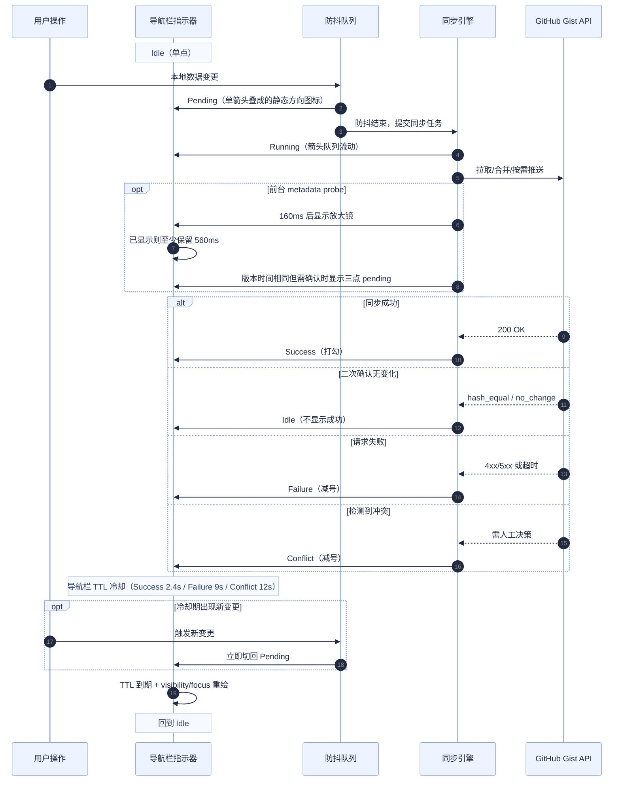

# S1 Plus 开发手册（当前代码基线：v6.10.0 + 当前分支未发布同步重构）

> 本文档基于当前 `S1Plus.js` 实现整理，用于指导后续开发、调试、测试与发布。

## 1. 项目形态与约束

- 架构：单文件用户脚本（`S1Plus.js`）
- 构建：无打包/编译步骤，直接编辑源码
- 运行环境：Tampermonkey / Violentmonkey / Greasemonkey
- 核心依赖：Greasemonkey API（`GM_*`）+ 浏览器 DOM API

这意味着所有改动都应以“可直接在浏览器执行”为前提，避免引入构建期依赖。

## 2. 本地开发（保存即生效）

### 2.1 浏览器前置设置（Chrome/Edge）

1. 打开 `chrome://extensions`
2. 进入 Tampermonkey 的“详情”
3. 开启“允许访问文件网址（Allow access to file URLs）”

### 2.2 推荐 Loader（本地文件热加载）

仓库里已经提供了两份可直接使用的本地加载器：

- `S1Plus-Local-Mac.user.js`
- `S1Plus-Local-Windows.user.js`

如果要手动新建，也可以参考下面这个模板：

```javascript
// ==UserScript==
// @name         S1 Plus (Local)
// @namespace    http://tampermonkey.net/
// @version      99.9.10
// @description  本地开发加载器
// @author       Antigravity
// @match        https://stage1st.com/2b/*
// @require      file:///[YOUR_LOCAL_PATH]/S1Plus.js
// @grant        GM_setValue
// @grant        GM_getValue
// @grant        GM_addStyle
// @grant        GM_deleteValue
// @grant        GM_xmlhttpRequest
// @grant        GM_openInTab
// @grant        GM_download
// @grant        GM_addValueChangeListener
// @connect      *
// ==/UserScript==

(function () {
    "use strict";
    console.log("[S1 Plus] Local loader active");
})();
```

注意事项：

- 关闭线上正式脚本，避免双实例冲突
- `@require` 必须是绝对路径
- Windows 路径示例：`file:///C:/Users/Name/S1Plus-Manual/S1Plus.js`
- 本地 Loader 的 `@grant` / `@connect` 需要与主脚本保持一致；当前主脚本使用 `@connect *`

### 2.3 迁移回归校验（建议每次改设置迁移后执行）

```bash
node sync-across-multiple-tab/scripts/test-settings-migration.js
```

说明：

- 用例夹具：`tests/settings-migration/fixtures.json`
- 覆盖重点：旧版 `openInNewTab` 结构迁移、布尔归一化、自动补链旧键迁移、Token 到期字段归一化等

### 2.4 同步回归脚本（本轮多标签页重构）

当前仓库把同步专项测试脚本收敛在 `sync-across-multiple-tab/scripts/`，常见入口包括：

- `test-foreground-remote-probe.js`
- `test-foreground-trigger-integration.js`
- `test-visible-remote-polling.js`
- `test-post-sync-refresh-policy.js`
- `test-safe-sync-execution.js`
- `test-cleanup-provenance-guard.js`
- `test-background-open-passive-session.js`

建议在改动以下能力后优先回归对应脚本：

- 前台探测 / 可见页轮询
- 自动拉取后的刷新策略
- cleanup provenance 与手动同步分支
- 设置迁移与同步设置 UI

### 2.5 右下角统一调试面板

代码中保留了可复用的浮动调试面板框架，现整合为统一的 `#s1p-debug-unified-panel`，通过 tabs 组织三个子面板，默认不自动显示。

**入口方式**：设置弹窗底部版本号悬停 4s 出现小圆点后点击，打开统一面板；无其他入口。

**面板结构**：

| Tab | 内容 | 说明 |
|-----|------|------|
| 日志 | 调试控制台 | 捕获 console 输出、JS 错误、unhandledrejection；支持按级别筛选、关键词搜索、复制/清空/展开；可拖拽 resize，尺寸持久化到 `s1p_debug_console_size`；日志缓冲区最多保留 1000 条，通过 `sessionStorage` 在同标签页刷新后自动恢复，关闭标签页后销毁 |
| 诊断信息 | 同步诊断 | 展示 `buildSyncDiagnosticsRows()` 的诊断行（最近动作/触发源/结果/阻断/哈希/探测等）；[刷新][复制诊断][重置诊断] 按钮 |
| 指示器调试 | 同步指示器调试 | 手动切换指示器 phase、选择 source/operation、播放转场 Demo；只覆盖导航栏指示器预览，不改真实同步状态 |

**实现要点**：

- tab bar 复用 `s1p-tabs` 样式（与设置面板 tab 统一），靠左对齐，带 slider 高亮动画
- 面板搜索框复用 `.s1p-input` 样式
- 日志 tab 的 toolbar 布局为 head-actions 在上行、filter-bar 在下行
- 诊断信息 tab 的重置操作使用内联确认栏而非原生 `confirm()` 弹窗
- 指示器调试面板仍可通过 `window.__s1pAutoSyncIndicatorDebug` API 控制：
  - `showPanel()` — 打开统一面板并切到指示器调试 tab
  - `hidePanel()` — 隐藏统一面板
  - `clear()` — 清除调试覆盖

**使用约束**：

- 调试面板只覆盖导航栏指示器的预览显示，不会改写真实同步状态
- 面板中“实际 phase/source/operation”仍读取真实状态，可用于对照预览覆盖
- `running` 等状态的调试预览会跳过真实同步锁门控，仅用于人工观察 UI
- 统一面板的显示状态持久化到 `s1p_debug_console_visible`（GM 存储，跨标签一致）；尺寸持久化到 `s1p_debug_console_size`（GM 存储）
- 日志收集器生命周期：仅在调试面板可见时启动（`document-start` 阶段检查 `s1p_debug_console_visible`）；面板隐藏时调用 `stopLogCollector()` 恢复原始 console 方法并移除事件监听器
- 日志持久化：通过 `sessionStorage` 键 `s1p_log_buffer` 实现，每条日志 300ms 防抖写入；刷新页面后 `restoreLogBufferFromSession()` 自动恢复（包括展开状态）；清空日志时同步清除 sessionStorage
- 日志收集器可在同页面会话内多次启停（通过 `startLogCollector` / `stopLogCollector`），原始 console 引用仅在首次启动时捕获（`_originalConsoleCaptured` 守卫），避免多轮 bind 嵌套
- 这套面板框架应优先作为通用调试容器复用，而非为每个功能再单独写一套浮动面板

## 3. 多机协作流程（Git）

### 3.1 首次在新设备

1. `git clone` 仓库
2. 按上节配置本地 Loader
3. 校验 `@require` 路径

### 3.2 日常

- 设备 A：`git add` -> `git commit` -> `git push`
- 设备 B：`git pull`
- 刷新论坛页面即生效（无需重装脚本）

## 4. 代码模块地图（按职责）

可在 `S1Plus.js` 搜索以下函数快速定位。

### 4.1 安全与基础工具

- `sanitizeHtmlFragment`：受控 HTML 白名单清洗
- `getSafeUrlAttributeValue`：URL 安全校验
- `isPrimaryUnmodifiedClick`：统一判定“普通左键点击”（排除 Ctrl/Cmd/Shift/Alt 与已拦截事件）
- `sanitizeRecordObject`：对象键净化（防原型链污染）
- `deterministicSort` / `sha256`：稳定序列化与哈希

### 4.2 数据层与缓存

- `getSettings` / `saveSettings`
- `getBlockedThreads` / `saveBlockedThreads`
- `getBlockedUsers` / `saveBlockedUsers`
- `getBlockedPosts` / `saveBlockedPosts`
- `getUserTags` / `saveUserTags`
- `getBookmarkedReplies` / `saveBookmarkedReplies`
- `getTitleFilterRules` / `saveTitleFilterRules`
- `getReadProgress` / `saveReadProgress`

### 4.3 同步引擎

- `exportLocalDataObject` / `importLocalData`
- `fetchRemoteData` / `pushRemoteData`
- `performAutoSync`（自动同步决策与执行）
- `handleManualSync`（手动同步流程）
- `decideSyncActionByVersion`（基线 + 哈希 + 时间戳判定）

### 4.4 UI 主干

- `createManagementModal`（7 个 tab 设置面板）
- `initializeNavbar`（导航注入、同步按钮、状态指示）
- `createAdvancedConfirmationModal`（统一确认弹窗）

### 4.5 页面增强主入口

- `runS1PlusInitializer`：脚本实际入口，先运行 `document-start` 阶段，再等待 `document.body`。
- `S1P_INIT_PHASES` / `runInitializationPhase`：分阶段初始化框架，当前阶段为 `document-start`、`body-ready`、`forum-ready`、`services-ready`、`content-ready`、`deferred`。
- `main`：body ready 后的初始化总控，按阶段调度迁移、论坛 DOM 依赖任务、服务注册、内容扫描与延后同步。
- `applyChanges`：全量应用
- `MutationObserver` 增量分发：列表/帖子/引用/评分/提醒五路处理

实现约束（维护时请保持）：

- `document-start` 阶段只放低依赖、防闪烁类任务；不要依赖完整论坛 DOM。
- 依赖论坛结构或 NUX 标记的逻辑应放在 `forum-ready`，并通过框架的 `retryDelays` / `shouldRetry` 表达等待条件。
- 首次 DOM 扫描和 MutationObserver 挂载属于 `content-ready`；启动同步、推荐弹窗等非首屏任务属于 `deferred`。
- 后台任务如果会影响后续判断，应通过 `contextKey` 暴露 promise，例如 NUX 推荐会等待 `nuxDetectionPromise`，避免检测未结束时误判。

### 4.6 增强悬浮控件（Floating Controls）

- `manageFloatingControls`：根据设置开关统一创建/销毁增强悬浮控件
- `createCustomFloatingControls`：构建手柄 + 动作面板 + 按钮（语义化 `a/button`）
- `bindFloatingControlsHoverInteraction`：控件交互状态机（悬停开合、固定展开、外部点击关闭）

实现约束（维护时请保持）：

- 使用单一开合状态源：仅通过 `s1p-floating-controls-open` class 控制显隐，避免 CSS `:hover` 与 JS 定时器竞态。
- 悬停判定基于“交互区域来源集合”（handle/panel），不要回退为依赖 wrapper 自身 hover。
- 关闭路径分为两类：延迟收起（hover 离开）与立即收起（取消固定/外部点击），两者清理逻辑需统一。

### 4.7 通用 Tooltip

- `setCustomTooltip`：注册普通 tooltip，并负责清理所有 tooltip 相关 dataset，避免节点复用时残留旧配置。
- `setTemplateTooltip`：注册模板型 tooltip，统一写入 `delay / maxWidth / templateId` 配置；不要在调用处手写零散 dataset 赋值。
- `initializeGenericDisplayPopover`：统一处理普通/溢出/文档型 tooltip 的渲染、定位、滚动/缩放重排与宽度缓存。

实现约束（维护时请保持）：

- 新增富文本 tooltip 时，优先在 `tooltipTemplateConfigs` 中登记行为配置，再通过 `setTemplateTooltip` 接入调用点。
- 若模板 tooltip 依赖测宽缓存，需保持 `resize` 时清空缓存并重测，避免旧视口宽度残留。
- 需要取消 tooltip 时，优先走 `clearCustomTooltip`，不要只删 `fullTag` 或 class。
- 手柄需同步 `aria-expanded`，动作型入口优先使用 `button`，仅导航型入口使用 `a`。

## 5. 存储键说明（GM Key）

### 5.1 业务数据

- `s1p_settings`
- `s1p_blocked_threads`
- `s1p_blocked_users`
- `s1p_blocked_posts`
- `s1p_user_tags`
- `s1p_bookmarked_replies`
- `s1p_title_filter_rules`
- `s1p_read_progress`

### 5.2 同步与状态

- `s1p_last_modified`
- `s1p_last_sync_timestamp`
- `s1p_sync_baseline_state`
- `s1p_sync_diagnostics`
- `s1p_pending_auto_sync_request`
- `s1p_auto_sync_indicator_state`
- `s1p_auto_sync_failure_count`
- `s1p_auto_sync_circuit_open_until`
- `s1p_auto_sync_conflict_pause`

### 5.3 锁与跨标签

- `s1p_background_sync_lock`
- `s1p_manual_sync_lock`
- `s1p_startup_sync_lock`
- `s1p_sync_global_lock`
- `s1p_sync_conflict_modal_cooldown_lock`
- `s1p_settings_refresh_signal`

### 5.4 其他状态

- `s1p_last_daily_sync_date`
- `s1p_last_manual_sync_info`
- `s1p_pending_cleanup_info`
- `s1p_last_token_check_date`
- `s1p_blocked_posts_collapsed_threads`
- `signedDate_<uid>` / `signedAttemptDate_<uid>`（自动签到）
- `s1p_v<version>_welcomed`（版本欢迎弹窗）
- `s1p_debug_console_visible`（调试面板显示状态，GM 存储，跨标签一致）
- `s1p_debug_console_size`（调试面板尺寸，GM 存储）

### 5.5 sessionStorage 键

以下键使用 `sessionStorage`（同标签页刷新保留，关闭标签页销毁）：

- `s1p_log_buffer`（调试日志缓冲区 JSON，含 entries / nextId / expandedIds）
- `s1p_navbar_sync_alert_session_dismiss_key`（导航栏同步提醒会话级关闭标记）

## 6. 同步机制要点（开发必须了解）

### 6.1 同步对象结构

`exportLocalDataObject()` 产出结构（当前版本 `5.0`）：

- `version`
- `lastUpdated`
- `contentHash`
- `baseContentHash`（不含阅读进度）
- `data`（settings + 全量业务数据）

### 6.2 决策优先级

1. 优先 baseline/hash 判定
2. 必要时回退时间戳判定（带 12h 偏差保护）
3. 双端都变更 -> 冲突
4. 仅阅读进度分歧且基础数据一致 -> 自动合并

补充：

- 启动期现在通过 startup orchestrator 决定执行路径：`fresh` 页面运行完整启动链路，`stale` 页面只顺延每日首次同步或直接跳过启动专属检查。
- 设置迁移归一化函数 `buildNormalizedSettings()` 现会返回 `migrationReasons`，用于定位本次迁移是由哪些旧字段/脏值触发。
- 同步检查模式已拆分为两个独立设置：`syncDailyFirstLoad` 仅控制“每日首次加载时同步”，`syncPerLoadCheckEnabled` 仅控制“每次页面加载时检查同步”；不要再依赖“关闭前者等于开启后者”的旧隐式语义。
- 当前触发源命名已显式收口为：
  - `daily_startup`
  - `per_load`
  - `page_load_visible`
  - `foreground_resume`
  - `visible_poll`
  - `background_push`
  - `manual_sync`

### 6.3 并发与保护

- 三类模式锁（手动/后台/启动）
- 全局锁防互撞
- 锁心跳续租，失锁即中止
- 自动同步熔断（连续失败 3 次暂停 10 分钟）
- 冲突暂停门控，防止冲突态继续自动推送
- 前台探测使用独立的 probe 锁、共享冷却（45s，跨标签）和本地冷却（12s，当前标签），避免多个标签页同时做 metadata-only probe
- `clean-state fence` 只用于本地自动 push 去重：本地干净不能证明另一台设备没有更新 Gist，因此页面首次可见 / 回到前台 / 可见页轮询的 metadata-only probe 不得用它跳过远端 `updated_at` 检查。
- 前台 follow-up sync 的局部脏状态优先落为 soft block；只有真正的全局冲突或明确需要人工处理时才升级为 hard pause

### 6.4 跨页面补偿

- `s1p_pending_auto_sync_request` 用于跨页面补发
- `pageshow`（含 bfcache）/`visibilitychange` 自动恢复补同步
- “每次页面加载时检查同步”会复用启动同步锁链路，避免多标签页同时发起远端检查。
- 前台 probe 命中远端变化但 follow-up sync 因锁占用等原因未能执行时，会登记补偿重试而不是直接丢弃本轮自动拉取机会。
- 自动拉取后需要刷新列表页 / 普通页时，默认延迟 `AUTO_PULL_RELOAD_DELAY_MS`（当前 3.2s）再刷新；刷新提示的 toast 会覆盖完整等待窗口，避免用户还没看清提示就被页面刷新打断。
- 后台打开帖子页会写入短寿命 opener hint；线程页会据此把会话标记为 `passiveBackgroundOpened`，降低后台开帖造成的假阅读进度。

### 6.5 统一自动同步指示器流转 (Auto Sync Indicator)

指示器现在用于反馈“自动同步体系”的摘要状态，而不再只是后台自动同步子模块的状态灯。

#### 简易流转全览
完全的极简状态单线变迁路径如下：
> `Idle` ➞ *(本地更改)* ➞ `Pending` ➞ *(防抖结束)* ➞ `Running` ➞ *(网络返回)* ➞ `Success / Failure / Conflict` ➞ *(TTL时间结束)* ➞ `Idle`

#### 详细节点与时序图
1. **触发 (Pending)**
   - 本地数据变更时，调用 `setAutoSyncIndicatorPendingPhase(reason)` 进入后台防抖 / 重试 / pending 队列。
   - Pending 会根据 `source + operation` 显示方向：后台本地变更默认是 `push`，启动 / 每次加载 / 首次可见 / 回到前台 / 可见页轮询默认是 `pull`。
   - 云端 `updated_at` 与本地已同步版本相同、但仍需二次确认的前台补偿重试，使用中性的三点 `sync` pending，并标记为“等待二次确认”，不显示为待拉取。
   - metadata-only probe 只发现 `updated_at` 变新、但前台补同步被本地 pending write / debounce 门禁暂缓时，也使用中性的三点 `sync` pending；等 full sync 真的决策出 `pull` 后才显示拉取方向。
   - Pending 的 `push` / `pull` 使用 running 单箭头 path 静态叠成双箭头，不再维护独立双箭头 SVG；动画只属于真正执行中的 `running`。
   - Pending 方向图标会放大到 `1.3`，切入相同方向的 Running 箭头队列时使用专门的尺寸衔接动画，避免从静态双箭头硬切到较小动态图标。
   - 只有无法判定方向时才回退到三点 `sync` 图标。
2. **执行 (Running)**
   - 防抖结束，或某条自动同步路径真正进入执行阶段后，调用对应的 indicator cycle 入口生成加锁 `token`。
   - 启动 / 前台 follow-up 这类“先检查再决策”的完整安全同步，在真正判定 `push` / `pull` 前先显示中性的三点 `sync` 图标，避免出现“先向下再向上”的误导性方向反转。
   - `push` 使用纯向上箭头队列动画，箭头持续上行；`pull` 使用纯向下箭头队列动画，箭头持续下行。Running 的方向队列会放大到 `1.18`，两者都继承 `currentColor`，并沿用统一的 `0.6px` 同色描边来保持与成功 / 失败图标的视觉重量一致。
   - `probe` 只表示前台 metadata-only 云端探测，图标为放大镜，使用独立的巡视式位移动画，不与真正的拉取 / 推送混用。
   - 前台 probe 有防闪策略：开始后延迟 `AUTO_SYNC_INDICATOR_PROBE_SHOW_DELAY_MS`（当前 160ms）才显示；如果已经显示，则至少保留 `AUTO_SYNC_INDICATOR_PROBE_MIN_VISIBLE_MS`（当前 560ms）后再切到拉取、成功或待命。
3. **结算 (Success / Failure / Conflict)**
   - 网络合并完成后，调用 `finishAutoSyncIndicatorCycle(token, phase)` 或 `setAutoSyncIndicatorResolvedPhase(phase)`。
   - **Success (成功)**：图标变为打勾（静止，无动画）。
   - `hash_equal` / `no_change` 这类二次确认结果会直接回到 `Idle`，不显示成功勾，也不会写入标题栏的 `[同步成功]` 提示。
   - **Failure / Conflict (失败或冲突)**：图标变为减号（静止，无动画）。
4. **冷却与复位 (Cooldown & Revert)**
   - 导航栏指示器根据结算类型进行秒级倒计时冷却：Success (2.4s) / Failure (9s) / Conflict (12s)。标题同步状态有独立的分钟级 TTL，不要混用两者。
   - TTL 到期后，随页面可见（visibilitychange）或聚焦重新触发 UI 渲染，自动复位回空闲时极简的单点 `idle` 状态。

实现注意：

- 快速完成的 metadata-only probe 不应点亮 indicator；慢 probe 只显示放大镜，不提前表达为拉取。
- `remote_probe_equal_ambiguous:*` 只是“版本时间相同后的保守二次确认”，不是远端更新命中；日志、pending 图标和标题状态都不要把它表达为拉取。
- 前台 retry pending 的运行时 `source` 必须从 `remote_probe_*:<triggerSource>` 原因中还原，不能统一写成 `foreground_resume`；否则 `displayOperation` 会被来源不一致保护丢弃，重新默认成待拉取箭头。
- 只有真正进入 follow-up safe sync、后台自动同步、手动同步锁，或达到可见阈值的 probe，才切换到 `running`。
- 当前实现已经为不同来源保留 `source` 字段，后续扩展时优先沿用现有来源枚举，而不是新增自由文本。
- `setSanitizedIconHtml()` 的 SVG 白名单允许 `path.class`，因为 push/pull 队列动画依赖 `.s1p-sync-flow-arrow`；新增图标 class 时仍需走白名单，不要绕过 sanitizer。



## 7. 改动约定（避免回归）

### 7.1 设置写入

- 读：`getSettings()`
- 写：`getSettingsForWrite()` + `saveSettings()`
- 不要直接改缓存对象引用

### 7.2 核心数据写入

- 必须通过 `save*` 系列函数
- 让时间戳、缓存、同步触发逻辑统一走标准路径

### 7.3 DOM 安全

- 用户数据默认走 `textContent`
- 需要 HTML 时必须走 `sanitizeHtmlFragment`
- 链接写入前走 `getSafeUrlAttributeValue`

### 7.4 监听器与弹窗生命周期

- 复用 `rebindTabClickHandler`，避免重复绑定
- 行内菜单/弹窗关闭时调用对应 `destroy`/`dismiss`

## 8. 测试清单（手工）

### 8.1 页面覆盖

- 帖子列表页
- 帖子详情页
- 个人空间/资料页
- 提醒/评分/引用场景

### 8.2 功能覆盖

- 帖子/用户/楼层屏蔽全链路
- 用户标记增删改 + 导入导出
- 收藏展开/搜索/取消收藏
- 阅读进度记录、跳转、清理（自动/手动）
- 图片查看器（缩放、拖拽、长按、切图、关闭恢复焦点）
- 纯文本链接自动转换与新标签行为
- 自动签到（正常/失败退避）

### 8.3 同步覆盖

- 远程空仓初始化
- 本地较新 / 云端较新 / 冲突三种分支
- 冲突后手动解决
- 自动合并阅读进度
- 弱网重试、锁竞争、跨标签并发
- 同步诊断显示与复制

## 9. 发布清单

1. 更新脚本元数据版本（`@version`）
2. 更新 `SCRIPT_VERSION` 与 `SCRIPT_RELEASE_DATE`
3. 更新 `CHANGELOG.md`
4. 更新欢迎弹窗文案 `showFirstTimeWelcomeIfNeeded`
5. 回归测试关键链路（屏蔽/阅读进度/同步/图片查看器）
6. 更新 `README.md` 与本开发文档（若行为变更）
7. 发布到 GreasyFork

## 10. 常见坑位

- Stage1st 页面结构变动会导致选择器失效
- 锁与同步流程是高敏区，改动前后要重点测并发与冲突
- 设置跨标签刷新要验证“打开中的设置面板”是否正确收敛
- 阅读进度导入/切换开关时，注意观察器是否正确重建/释放
- 阅读进度候选保存链路为“可见最大楼层 -> 最近一次可见楼层 -> 主楼兜底(1楼)”，调整逻辑时必须保持该优先级
- 楼层解析不能只依赖纯数字文案；需要兼容“楼主”等文本场景并验证仅主楼帖子

## 11. 设置面板动画机制（整合调试报告）

本节整合了原 `设置面板动画调试报告.md`，并按当前 `v6.10.0 + 当前分支未发布改动` 的代码口径更新。

### 11.1 动画通道总览

| 场景 | 关键实现 | 默认时长 | 是否动画 |
|---|---|---|---|
| Tab 内容切换（内容本体） | `.s1p-tab-content` 使用 `display: none/block` | N/A | ❌ |
| Tab 切换高度过渡 | `tab click` 中对 `.s1p-modal > .s1p-modal-content > .s1p-modal-body` 做 JS 高度过渡（持续像素锁 + 自动对齐） | `0.35s` | ✅ |
| Tab 滑块 | `.s1p-tab-slider` 的 `width/transform` 过渡（JS 驱动） | `0.35s`（`reduced-motion` 下 `0s`） | ✅ |
| 通用折叠区 | `.s1p-collapsible-content` `grid-template-rows: 0fr ↔ 1fr` + `padding-top` | `0.4s` | ✅ |
| 已屏蔽楼层分组 | `.s1p-thread-posts.s1p-collapsible-content` 同样走 `grid-template-rows` | `0.4s` | ✅ |
| 功能总开关展开 | `modal change` 事件中对 `.s1p-modal-body` 做 JS 高度过渡（FLIP 变体） | `0.35s` | ✅ |
| 功能内容区本体 | `.s1p-feature-content` 明确 `transition: none`（调试保留） | 禁用 | ⚠️（依赖父容器高度动画） |
| 帖内引用/提醒折叠 | `.s1p-quote-wrapper` / `.s1p-notification-wrapper` `max-height` 过渡 | `0.35s` | ✅ |

### 11.2 关键实现说明

1. Tab 的“内容区”不做过渡动画  
当前是 `display` 切换，浏览器无法对 `display` 过渡。

2. 总开关展开/收起与 Tab 切换共用同一套高度动画  
代码路径通过 `animateSettingsModalBodyHeight(...)` 统一触发（`change` 与 `tab click`）：

```javascript
animateSettingsModalBodyHeight(modalBody, () => {
  contentWrapper.classList.toggle("expanded", isChecked);
});
```

3. 高度动画采用“持续像素锁 + 自动对齐”  
动画收尾不立即切回 `height:auto`，以避免尾段抖动；当激活 tab 内容真实变化时，由 `ResizeObserver` 触发一次补偿对齐动画。为避免切换 tab 时“初始回调”引发二次弹动，会忽略首轮/次轮观察回调。

4. `.s1p-feature-content` 自身动画目前被禁用  
这是当前代码中的显式状态（`transition: none`），用于避免与父容器高度动画叠加导致节奏混乱。

5. Tab 切换复用同一套父容器高度过渡  
Tab 内容本体仍为 `display` 切换；视觉过渡来自 `.s1p-modal-body` 的高度动画，能根据不同 tab 内容高度平滑收敛。

### 11.3 与 S1 NUX 的动画冲突

`S1 NUX.css` 中存在全局规则：

- 文件：`S1 NUX.css`
- 关键选择器：`*:not(.v-binder-follower-content), *::before, *::after`
- 关键属性：`transition-duration: .15s`，且包含 `height/max-height/transform/padding/margin` 等

这会改写 S1 Plus 动画元素的计算样式，导致你看到的时长被统一压到 `0.15s`。

### 11.4 调试建议

1. 先临时禁用 S1 NUX，再调 S1 Plus 动画参数。  
2. 在 DevTools 看 `Computed` 的 `transition`，确认生效来源。  
3. 必要时提高 S1 Plus 规则优先级（更具体选择器或 `!important`）。  
4. 若要恢复 `.s1p-feature-content` 自身动画，要同时回归测试：
- 总开关展开/收起是否出现双重动画
- 面板高度是否抖动
- 窄屏（`max-width: 909px`）下是否出现布局跳变

### 11.5 近期重构与问题对照（2026-03）

| 问题 | 现象 | 最终方案 | 关键点 |
|---|---|---|---|
| P1：高度锁死 | 动画后若内容再变化，面板高度可能不跟随 | 保持“持续像素锁”，并在激活 tab 内容变化时由 `ResizeObserver` 触发补偿动画 | 不在收尾立刻 `height:auto`；采用 `scheduleModalBodyHeightReconcile` |
| P2：样式作用域过宽 | 通用 `.s1p-modal-body` 过渡可能影响其他弹窗 | 将高度过渡样式收敛到 `.s1p-modal > .s1p-modal-content > .s1p-modal-body` | 避免 token 配置等弹窗被误影响 |
| P3：缺少 reduced-motion 兜底 | 减少动态效果偏好下仍有动画 | CSS + JS 双层接入 `prefers-reduced-motion` | tab 滑块与高度过渡都可降到无动画 |
| P4：节奏不统一 | tab 滑块与高度过渡时长不一致，观感不同步 | 将 tab 滑块统一为 `0.35s`（与高度动画对齐） | `reduced-motion` 下滑块时长为 `0s` |
| 回归：尾段“弹一下” | 切 tab 后偶发额外一次补动画 | 仅观察 active tab + 切换时忽略首轮/次轮观察回调 | `updateObservedModalBodyTabContent` + `modalBodyObserverIgnoreCallbacks` |
| 兼容性：滚动条宽度跳变 | 不支持 `scrollbar-gutter` 的浏览器可能抖动 | 加 `@supports not (scrollbar-gutter: stable)` 兜底 | 降级为 `overflow-y: scroll` 固定滚动条占位 |
| P2 补强：重列表渲染压力 | 大数据下切 tab / 搜索输入时卡顿 | 对重列表引入分页 + 懒刷新策略 | 已覆盖：用户标记、屏蔽用户、手动屏蔽帖子、已屏蔽楼层分组、回复收藏 |
| P2 补强：收藏搜索中文输入 | 搜索框输入中文被中断 | 在收藏搜索输入上接入 `compositionstart/compositionend`，组合输入阶段跳过重渲染 | 同时保留防抖，组合结束后再统一刷新 |
| 代码简化：清理死代码 | 设置面板事件链路里保留了历史 helper | 移除不再被调用的 `renderEmptyState` / `removeListItem` | 仅做结构清理，不改变现有交互与动画行为 |

> 维护约定：设置面板高度动画如需再调整，优先修改 `animateSettingsModalBodyHeight`、`scheduleModalBodyHeightReconcile`、`updateObservedModalBodyTabContent` 三处，避免在点击/变更事件中散落重复逻辑。

补充约定（收藏搜索链路）：优先复用 `clearSettingsModalBookmarkSearchTimer`、`getSettingsModalBookmarkSearchKeywords`、`filterSettingsModalBookmarkItemsByKeywords`，避免在 `renderBookmarksTab` 内重复拼接同类逻辑。

### 11.6 长期结构化重构方案（提案）

> 状态：未实施（架构提案）。目标是在保持当前交互体验的前提下，进一步降低高度测量误差与回归风险。

#### S1 主方案

结构重构：Tab 全挂载 + 容器 `grid/stack` 切换。  
不再依赖 `display: none/block` 作为主切换手段，改为统一内容容器结构，让高度来自同一布局流。  
优点：从根上减少测量误差。  
代价：改动面最大，回归成本最高。

#### 配套问题与对策（围绕 S1）

| 编号 | 问题 | 对策 |
|---|---|---|
| P2 | 性能坑 | 只保活 `active + 邻近预热 tab`，其余采用 `content-visibility: hidden` 或懒渲染；重列表优先虚拟化或分页；高度动画收敛到单帧 reconcile。 |
| P3 | 可访问性坑 | 非激活面板加 `inert` + `aria-hidden="true"`；激活面板移除 `inert` 并做焦点回位；Tab 组件对齐 WAI-ARIA（`role="tablist/tab/tabpanel"`、`aria-selected`、`aria-controls`）。 |
| P4 | 事件与状态坑 | 采用“单次绑定 + 事件委托”，避免切 tab 重复绑定；渲染函数保持幂等；脏状态统一归档到状态层，不与 DOM 生命周期耦合。 |
| P5 | 高度兜底坑 | 主策略为结构化布局减少测量；兜底仅对 active panel 使用 `ResizeObserver` reconcile；异步批量更新合并到一次 `requestAnimationFrame`。 |
| P6 | 主题冲突坑（NUX） | 动画样式挂在更高特异性容器（如 `.s1p-modal > .s1p-modal-content`）；仅对高度过渡等核心属性按需 `!important`；检测 NUX 时启用隔离类覆盖其全局 `transition-duration`。 |

> 说明：该提案不是“6 个并列方案”，而是 “1 个主方案（S1）+ 5 个配套问题与对策（P2~P6）”。
