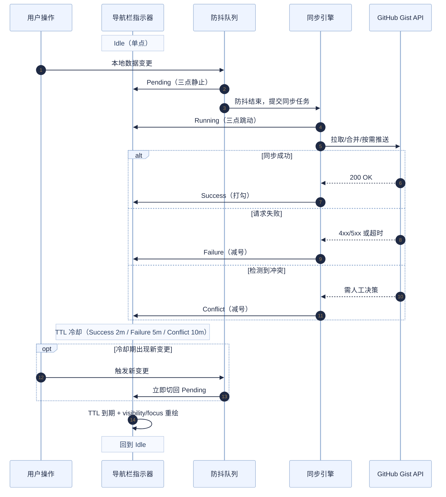

# S1 Plus 开发手册（当前代码基线：v6.7.0）

> 本文档基于当前 `S1Plus.js` 实现整理，用于指导后续开发、调试、测试与发布。

## 1. 项目形态与约束

- 架构：单文件用户脚本（`S1Plus.js`）
- 构建：无打包/编译步骤，直接编辑源码
- 运行环境：Tampermonkey / Violentmonkey / Greasemonkey
- 核心依赖：Greasemonkey API（`GM_*`）+ 浏览器 DOM API

这意味着所有改动都应以“可直接在浏览器执行”为前提，避免引入构建期依赖。

## 2. 本地开发（保存即生效）

### 2.1 浏览器前置设置（Chrome/Edge）

1. 打开 `chrome://extensions`
2. 进入 Tampermonkey 的“详情”
3. 开启“允许访问文件网址（Allow access to file URLs）”

### 2.2 推荐 Loader（本地文件热加载）

在 Tampermonkey 新建脚本 `S1 Plus (Local)`：

```javascript
// ==UserScript==
// @name         S1 Plus (Local)
// @namespace    http://tampermonkey.net/
// @version      99.9.9
// @description  本地开发加载器
// @author       moekyo
// @match        https://stage1st.com/2b/*
// @require      file:///[YOUR_LOCAL_PATH]/S1Plus.js
// @grant        GM_setValue
// @grant        GM_getValue
// @grant        GM_addStyle
// @grant        GM_deleteValue
// @grant        GM_xmlhttpRequest
// @grant        GM_openInTab
// @grant        GM_download
// @grant        GM_addValueChangeListener
// @connect      stage1st.com
// @connect      img.stage1st.com
// @connect      api.github.com
// @connect      gist.githubusercontent.com
// ==/UserScript==

(function () {
    "use strict";
    console.log("[S1 Plus] Local loader active");
})();
```

注意事项：

- 关闭线上正式脚本，避免双实例冲突
- `@require` 必须是绝对路径
- Windows 路径示例：`file:///C:/Users/Name/S1Plus-Manual/S1Plus.js`
- 本地 Loader 的 `@grant` / `@connect` 需要与主脚本保持一致；若缺少 `img.stage1st.com`，图片保存会被 Tampermonkey 拦截

### 2.3 迁移回归校验（建议每次改设置迁移后执行）

```bash
node scripts/test-settings-migration.js
```

说明：

- 用例夹具：`tests/settings-migration/fixtures.json`
- 覆盖重点：旧版 `openInNewTab` 结构迁移、布尔归一化、自动补链旧键迁移、Token 到期字段归一化等

## 3. 多机协作流程（Git）

### 3.1 首次在新设备

1. `git clone` 仓库
2. 按上节配置本地 Loader
3. 校验 `@require` 路径

### 3.2 日常

- 设备 A：`git add` -> `git commit` -> `git push`
- 设备 B：`git pull`
- 刷新论坛页面即生效（无需重装脚本）

## 4. 代码模块地图（按职责）

可在 `S1Plus.js` 搜索以下函数快速定位。

### 4.1 安全与基础工具

- `sanitizeHtmlFragment`：受控 HTML 白名单清洗
- `getSafeUrlAttributeValue`：URL 安全校验
- `isPrimaryUnmodifiedClick`：统一判定“普通左键点击”（排除 Ctrl/Cmd/Shift/Alt 与已拦截事件）
- `sanitizeRecordObject`：对象键净化（防原型链污染）
- `deterministicSort` / `sha256`：稳定序列化与哈希

### 4.2 数据层与缓存

- `getSettings` / `saveSettings`
- `getBlockedThreads` / `saveBlockedThreads`
- `getBlockedUsers` / `saveBlockedUsers`
- `getBlockedPosts` / `saveBlockedPosts`
- `getUserTags` / `saveUserTags`
- `getBookmarkedReplies` / `saveBookmarkedReplies`
- `getTitleFilterRules` / `saveTitleFilterRules`
- `getReadProgress` / `saveReadProgress`

### 4.3 同步引擎

- `exportLocalDataObject` / `importLocalData`
- `fetchRemoteData` / `pushRemoteData`
- `performAutoSync`（自动同步决策与执行）
- `handleManualSync`（手动同步流程）
- `decideSyncActionByVersion`（基线 + 哈希 + 时间戳判定）

### 4.4 UI 主干

- `createManagementModal`（7 个 tab 设置面板）
- `initializeNavbar`（导航注入、同步按钮、状态指示）
- `createAdvancedConfirmationModal`（统一确认弹窗）

### 4.5 页面增强主入口

- `main`：初始化总控
- `applyChanges`：全量应用
- `MutationObserver` 增量分发：列表/帖子/引用/评分/提醒五路处理

### 4.6 增强悬浮控件（Floating Controls）

- `manageFloatingControls`：根据设置开关统一创建/销毁增强悬浮控件
- `createCustomFloatingControls`：构建手柄 + 动作面板 + 按钮（语义化 `a/button`）
- `bindFloatingControlsHoverInteraction`：控件交互状态机（悬停开合、固定展开、外部点击关闭）

实现约束（维护时请保持）：

- 使用单一开合状态源：仅通过 `s1p-floating-controls-open` class 控制显隐，避免 CSS `:hover` 与 JS 定时器竞态。
- 悬停判定基于“交互区域来源集合”（handle/panel），不要回退为依赖 wrapper 自身 hover。
- 关闭路径分为两类：延迟收起（hover 离开）与立即收起（取消固定/外部点击），两者清理逻辑需统一。
- 手柄需同步 `aria-expanded`，动作型入口优先使用 `button`，仅导航型入口使用 `a`。

## 5. 存储键说明（GM Key）

### 5.1 业务数据

- `s1p_settings`
- `s1p_blocked_threads`
- `s1p_blocked_users`
- `s1p_blocked_posts`
- `s1p_user_tags`
- `s1p_bookmarked_replies`
- `s1p_title_filter_rules`
- `s1p_read_progress`

### 5.2 同步与状态

- `s1p_last_modified`
- `s1p_last_sync_timestamp`
- `s1p_sync_baseline_state`
- `s1p_sync_diagnostics`
- `s1p_pending_auto_sync_request`
- `s1p_auto_sync_indicator_state`
- `s1p_auto_sync_failure_count`
- `s1p_auto_sync_circuit_open_until`
- `s1p_auto_sync_conflict_pause`

### 5.3 锁与跨标签

- `s1p_background_sync_lock`
- `s1p_manual_sync_lock`
- `s1p_startup_sync_lock`
- `s1p_sync_global_lock`
- `s1p_sync_conflict_modal_cooldown_lock`
- `s1p_settings_refresh_signal`

### 5.4 其他状态

- `s1p_last_daily_sync_date`
- `s1p_last_manual_sync_info`
- `s1p_pending_cleanup_info`
- `s1p_last_token_check_date`
- `s1p_blocked_posts_collapsed_threads`
- `signedDate_<uid>` / `signedAttemptDate_<uid>`（自动签到）
- `s1p_v<version>_welcomed`（版本欢迎弹窗）

## 6. 同步机制要点（开发必须了解）

### 6.1 同步对象结构

`exportLocalDataObject()` 产出结构（当前版本 `5.0`）：

- `version`
- `lastUpdated`
- `contentHash`
- `baseContentHash`（不含阅读进度）
- `data`（settings + 全量业务数据）

### 6.2 决策优先级

1. 优先 baseline/hash 判定
2. 必要时回退时间戳判定（带 12h 偏差保护）
3. 双端都变更 -> 冲突
4. 仅阅读进度分歧且基础数据一致 -> 自动合并

补充：

- 设置迁移归一化函数 `buildNormalizedSettings()` 现会返回 `migrationReasons`，用于定位本次迁移是由哪些旧字段/脏值触发。

### 6.3 并发与保护

- 三类模式锁（手动/后台/启动）
- 全局锁防互撞
- 锁心跳续租，失锁即中止
- 自动同步熔断（连续失败 3 次暂停 10 分钟）
- 冲突暂停门控，防止冲突态继续自动推送

### 6.4 跨页面补偿

- `s1p_pending_auto_sync_request` 用于跨页面补发
- `pageshow`（含 bfcache）/`visibilitychange` 自动恢复补同步

### 6.5 自动后台同步指示器流转 (Auto Sync Indicator)

指示器主要用于在导航栏反馈同步队列和网络状态，具备跨标签页同步动画的能力。

#### 简易流转全览
完全的极简状态单线变迁路径如下：
> `Idle` ➞ *(本地更改)* ➞ `Pending` ➞ *(防抖结束)* ➞ `Running` ➞ *(网络返回)* ➞ `Success / Failure / Conflict` ➞ *(TTL时间结束)* ➞ `Idle`

#### 详细节点与时序图
1. **触发 (Pending)**
   - 本地数据变更时，调用 `setAutoSyncIndicatorPendingPhase(reason)` 进入防抖队列。
   - 显示静止的三个点图标，不会打断正在执行的其他同步任务。
2. **执行 (Running)**
   - 防抖结束，调用 `startBackgroundAutoSyncIndicatorCycle(reason)` 生成加锁 `token`。
   - 图标触发 `.s1p-auto-sync-running` 类，内部三个小点（`.s1p-dot`）执行 `s1p-auto-sync-dot-bounce` 波浪形依次跳动动画。
3. **结算 (Success / Failure / Conflict)**
   - 网络合并完成后，调用 `finishBackgroundAutoSyncIndicatorCycle(token, phase)`。
   - **Success (成功)**：图标变为打勾（静止，无动画）。
   - **Failure / Conflict (失败或冲突)**：图标变为减号（静止，无动画）。
4. **冷却与复位 (Cooldown & Revert)**
   - 根据结算类型进行自动倒计时冷却：Success (2分钟) / Failure (5分钟) / Conflict (10分钟)。
   - TTL 到期后，随页面可见（visibilitychange）或聚焦重新触发 UI 渲染，自动复位回空闲时极简的单点 `idle` 状态。



## 7. 改动约定（避免回归）

### 7.1 设置写入

- 读：`getSettings()`
- 写：`getSettingsForWrite()` + `saveSettings()`
- 不要直接改缓存对象引用

### 7.2 核心数据写入

- 必须通过 `save*` 系列函数
- 让时间戳、缓存、同步触发逻辑统一走标准路径

### 7.3 DOM 安全

- 用户数据默认走 `textContent`
- 需要 HTML 时必须走 `sanitizeHtmlFragment`
- 链接写入前走 `getSafeUrlAttributeValue`

### 7.4 监听器与弹窗生命周期

- 复用 `rebindTabClickHandler`，避免重复绑定
- 行内菜单/弹窗关闭时调用对应 `destroy`/`dismiss`

## 8. 测试清单（手工）

### 8.1 页面覆盖

- 帖子列表页
- 帖子详情页
- 个人空间/资料页
- 提醒/评分/引用场景

### 8.2 功能覆盖

- 帖子/用户/楼层屏蔽全链路
- 用户标记增删改 + 导入导出
- 收藏展开/搜索/取消收藏
- 阅读进度记录、跳转、清理（自动/手动）
- 图片查看器（缩放、拖拽、长按、切图、关闭恢复焦点）
- 纯文本链接自动转换与新标签行为
- 自动签到（正常/失败退避）

### 8.3 同步覆盖

- 远程空仓初始化
- 本地较新 / 云端较新 / 冲突三种分支
- 冲突后手动解决
- 自动合并阅读进度
- 弱网重试、锁竞争、跨标签并发
- 同步诊断显示与复制

## 9. 发布清单

1. 更新脚本元数据版本（`@version`）
2. 更新 `SCRIPT_VERSION` 与 `SCRIPT_RELEASE_DATE`
3. 更新 `CHANGELOG.md`
4. 更新欢迎弹窗文案 `showFirstTimeWelcomeIfNeeded`
5. 回归测试关键链路（屏蔽/阅读进度/同步/图片查看器）
6. 更新 `README.md` 与本开发文档（若行为变更）
7. 发布到 GreasyFork

## 10. 常见坑位

- Stage1st 页面结构变动会导致选择器失效
- 锁与同步流程是高敏区，改动前后要重点测并发与冲突
- 设置跨标签刷新要验证“打开中的设置面板”是否正确收敛
- 阅读进度导入/切换开关时，注意观察器是否正确重建/释放
- 阅读进度候选保存链路为“可见最大楼层 -> 最近一次可见楼层 -> 主楼兜底(1楼)”，调整逻辑时必须保持该优先级
- 楼层解析不能只依赖纯数字文案；需要兼容“楼主”等文本场景并验证仅主楼帖子

## 11. 设置面板动画机制（整合调试报告）

本节整合了原 `设置面板动画调试报告.md`，并按当前 `v6.7.0` 代码口径更新。

### 11.1 动画通道总览

| 场景 | 关键实现 | 默认时长 | 是否动画 |
|---|---|---|---|
| Tab 内容切换 | `.s1p-tab-content` 使用 `display: none/block` | N/A | ❌（内容本体） |
| Tab 滑块 | `.s1p-tab-slider` 的 `width/transform` 过渡（JS 驱动） | `0.35s` | ✅ |
| 通用折叠区 | `.s1p-collapsible-content` `grid-template-rows: 0fr ↔ 1fr` + `padding-top` | `0.4s` | ✅ |
| 已屏蔽楼层分组 | `.s1p-thread-posts.s1p-collapsible-content` 同样走 `grid-template-rows` | `0.4s` | ✅ |
| 功能总开关展开 | `modal change` 事件中对 `.s1p-modal-body` 做 JS 高度过渡（FLIP 变体） | `0.35s` | ✅ |
| 功能内容区本体 | `.s1p-feature-content` 明确 `transition: none`（调试保留） | 禁用 | ⚠️（依赖父容器高度动画） |
| 帖内引用/提醒折叠 | `.s1p-quote-wrapper` / `.s1p-notification-wrapper` `max-height` 过渡 | `0.35s` | ✅ |

### 11.2 关键实现说明

1. Tab 的“内容区”不做过渡动画  
当前是 `display` 切换，浏览器无法对 `display` 过渡。

2. 总开关展开/收起动画由 JS 控制父容器高度  
代码路径在设置面板 `modal.addEventListener("change", ...)` 中：

```javascript
const oldHeight = modalBody.offsetHeight;
modalBody.style.height = `${oldHeight}px`;
contentWrapper.classList.toggle("expanded", isChecked);
requestAnimationFrame(() => {
  modalBody.style.height = "auto";
  const newHeight = modalBody.offsetHeight;
  modalBody.style.height = `${oldHeight}px`;
  requestAnimationFrame(() => {
    modalBody.style.height = `${newHeight}px`;
  });
});
```

3. `.s1p-feature-content` 自身动画目前被禁用  
这是当前代码中的显式状态（`transition: none`），用于避免与父容器高度动画叠加导致节奏混乱。

### 11.3 与 S1 NUX 的动画冲突

`S1 NUX.css` 中存在全局规则：

- 文件：`S1 NUX.css`
- 关键选择器：`*:not(.v-binder-follower-content), *::before, *::after`
- 关键属性：`transition-duration: .15s`，且包含 `height/max-height/transform/padding/margin` 等

这会改写 S1 Plus 动画元素的计算样式，导致你看到的时长被统一压到 `0.15s`。

### 11.4 调试建议

1. 先临时禁用 S1 NUX，再调 S1 Plus 动画参数。  
2. 在 DevTools 看 `Computed` 的 `transition`，确认生效来源。  
3. 必要时提高 S1 Plus 规则优先级（更具体选择器或 `!important`）。  
4. 若要恢复 `.s1p-feature-content` 自身动画，要同时回归测试：
- 总开关展开/收起是否出现双重动画
- 面板高度是否抖动
- 窄屏（`max-width: 909px`）下是否出现布局跳变
